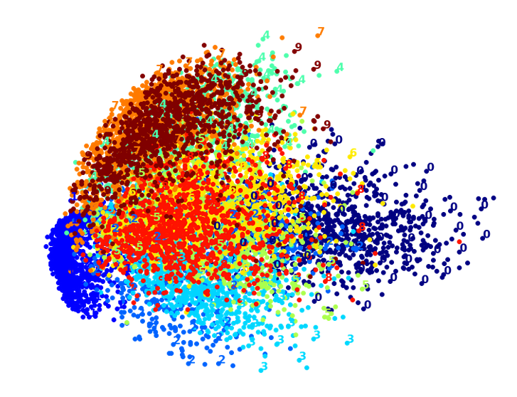

# Hands on Machine Learning with Scikit-learn and Tensorflow
## Notes and programs

Working through the book Hands-On Machine Learning with Scikit-learn and Tensorflow.
This book enables you to really get started with tensorflow suo moto.
This is my favorite visualisation from the book:

 
###  Ageron's machine learning checklist

1. Frame the problem and look at big picture
2. Get the data
3. Explore the data
4. Prepare the data:
        a. work on copies of data
        b. write functions for all data transformations
        c. remove outlier
        d. fill in missing values
        e. feature selection, drop attribute
        f. discretize continous features
        g. decompose features
        h. feature scaling
     
5. Short list promising models:
        a. train quick and dirty models
        b. do n fold crossvalidation
        c. analyse type of errors

6. Fine tune the system
7. Try ensemble methods to combine
8. Present the solution
9. Launch

### Easter egg at the end of chapter 16 

_Agerons message:_
       
        "Before we close the last chapter of this book, I would like to thank you for reading it up to the last paragraph. I truly hope that you had as much pleasure reading this book as I had writing it, and that it will be useful for your projects, big or small... My greatest hope is that this book will inspire you to build a wonderful ML application that will benefit all of us! What will it be?"
        

