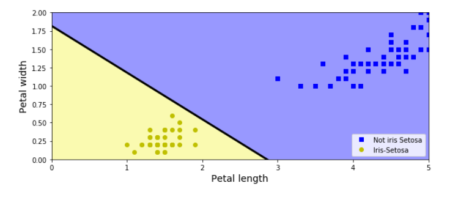
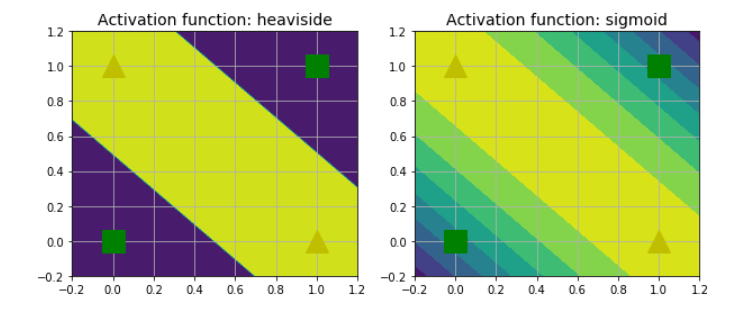
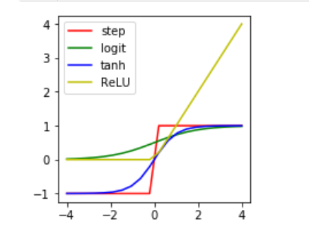
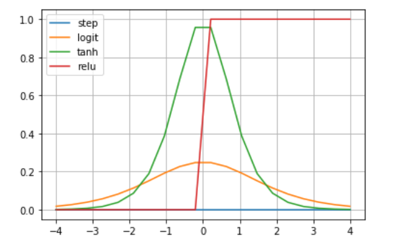
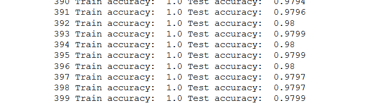
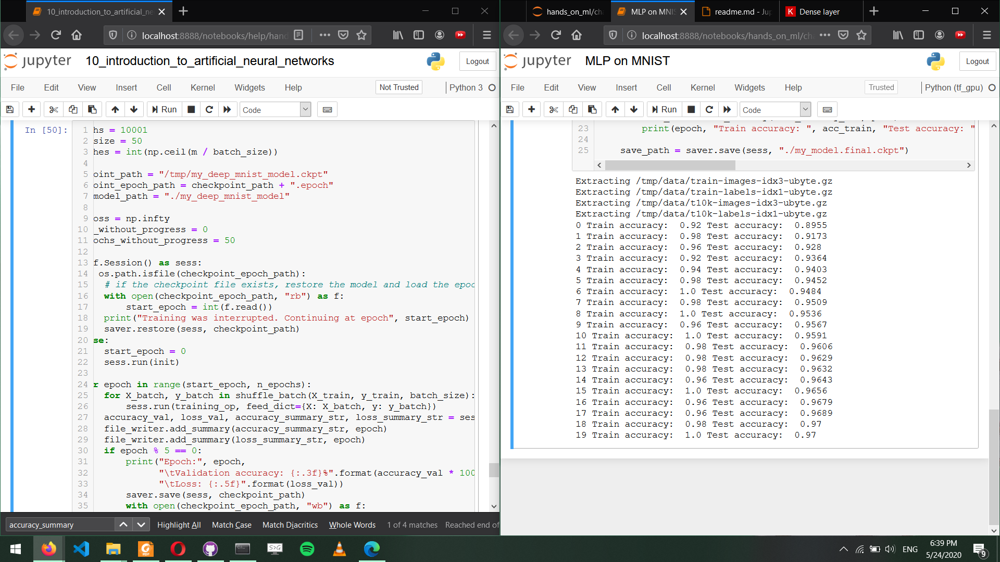

# Artificial Neural Network

Artificial neural netwrok werer first introduced backin 1943 by Warren McCulloh on propositional logic.

Perceptron introduced in 1957
the decision boundary of each output neuron is linear so perceptron are incapable of learning complex patterns, just like logistic regression calssifiers
This is also called the perceptron convergence theoram

scikit learn provides a Perceptron class, that implements a single LTU network.

Since perceptron couldn't solve XOR problemthey had dropped it altogether

However it turns out that thel limitation of Perceptron can be solved by stacking multiple perceptron

Neuron that fire together wire together

### Multi layer perceptron and back propagation

A MLP is composed of one(passthrough) input layer and followed by one of more layers of LTU, and one final layer called the otput layer

When a ann has two ormore hidden layers it is called a deep neural network

in 1986, backpropagation was introduced. It can be described as Gradient Descent autodiff.

Gradient descent is the algorithm that involves updating a set of parameters to minimize a loss, and is typically in the form of

θt+1=θt−α∇θJ 

The nabla (upside down triangle) is the gradient of the loss with respect to the parameters, theta. To find this gradient, you need to differentiate the loss with respect to the parameters.

Automatic differentiation is a way of automating the acquisition of these derivatives. Normally, you would work out tediously the derivatives of each of the operations, and find how they combine to get the derivative of the loss wrt each of the parameters, but with automatic differentiation, this is algorithmically generated. The found derivatives are typically slower than hand crafted derivatives since humans are able to optimize unnecessary steps, which computers may not be able to find, but automatic differentiation way outweighs the disadvantages.

for each training instance, algorithm feeds it to the network and computes the output of every neuron in each consecutive layer, (this is the forward pass, just likewhen making predictions) then it measure the output error, and then computes how much each neuron in last hidden layer contruted to each ouput neuron's error. it continues till it reaches the input layer. 
forward and reverse passes of backpropatgation is simply reverse autodiff. The last step is a gradient descent based on the error calculated all accross the network

Or to put it simply. for each training instance the backpropagation algo‐
rithm first makes a prediction (forward pass), measures the error, then goes through
each layer in reverse to measure the error contribution from each connection (reverse
pass), and finally slightly tweaks the connection weights to reduce the error (Gradient
Descent step). 

### some of the activation functions
For gradient descent to work properly we replace the step function with logistic function sigma(z) = 1/(1 + exp(-z))

other popular activation functions are -
hyperbolic tangent function tanh(z) = 2sigma(2*z) - 1
the value is between -1 and 1, which helps in sppeding up to algoritm

Relu activation function -
Relu(z) = max(0,z) it is continuous bu not diffrentiable at z = 0, however it works fast

Activation functions:

Their derivative:

### Feed forward Neural network
The ouput of each neuron corresponds to the estimated probability of the corresponding class. Notice that the signal only flows in one direction from inputs to outputs.

### Using plain tensorflow

Using the number of hidden layer to be at 300 and 100, creating a placeholdervariable fo reach of the training instances. The actual nerual netweor has 2 hidden layers and they only differ by the number of inputs and the outputs they contain, output uses softmax

### Fine tuning of parameters

We can use randomised search as grid search is out of the question
and we can use toolssuch as oscar to speed up the hyperaparmaeter tweaking

1. Number of layers:

DNN handles large parameters thorugh reusing graph, similar to copy paste
lower hidden layers model low level datasets.

Hierarchical architecture help DNN converge faster and also helps generalise better

2. Number of Neurons per hidden layer

A common practice is to shape them as a funnel

We can also use early stopping to stop where we want to.
use big pantsthat will eventulaly shrink down

3. Activation functions:

Relu. it is faster. for hidden layer, and gradient descent does not get stuck on plateaus.

for output softmax layer is good as you can get class probabilities when classes are mutually exclusive

For regression no activation function is requred at output

## Exercises

2. A classical perceptroon will converge only if the datset is linearly seperable and it won't be able to estimate class probabilities, If you cahnge the percceptrin activaton to logistic acivation function (or the softmax activation if there are multipt neurons) Then it becomes equivalent to a logistic regression classiifer

3. Logistic activaiton functoin was used in MLP because its derivative is always nonzero, so gradient descent can always roll down the slope. when activation function is a step function, gradient descent cannot move, as there is no slope at all.

4. ReLU, Softmax, and tanh and step.

5. one input layer with 10 passthrough neuron
       one hidden layer with 0 neurons 
       one output layer with 3 artificial neurons
   
   input shape(None,10)
   shape of hidden layer weight vector = W(10,50)
   shape of bias vector(50)
   shpae of output layer (50,3)
   bias ofoutput vector (3)
   output matrix y(None, 3)
   functionto compute matrix Y = (X * Wh+ bh )* Wo + bo

6. classify email into ham or span -  one neuron in output layer
   activation function in the output layer - Logistic
   
   neurons required in MNIST - 10 neuron in output layer
   activation function in MNIST - softmax
   
   housing neurons required - one output neuron
   activation function required - no activation function
 
7. Back propagationis atechiniqu used to train artificial neural networks, it first generates the gradients of the cost function with regards to every model parameter(all weights and biases) and then provides a Gradient Descent step using these gradients. The backpropagation is typically performed thousands or millions of times,using many training batches, until the cost function converges to a minimium. Reversemdoe autodiff performs a forward pass thorugh computation graph, then performs a reverse pass. reverse mode autodiff is a technique ot compute gradients efficiently, it happens to be used by backpropagation.

note: when the values of predict can vary by many orders of magnitude then we may want to predict logrithm of target value than the target value directly, simply computing the exponential of the neural network will give the estimated value

8. Here is a list of all hyperparameter we can tweak in a MLP : the number of hidden layers, the number of neurons in each layer, the activation function in hidden layer and the output layer. ReLU is agood defau;t for hidden layers. The output layer in general you will want a logistic activation function for binary classification, the softmax activation function for multiclass classification, or no activation function for regression.

9. MLP on MNIST - 

 
 
 
 
    

