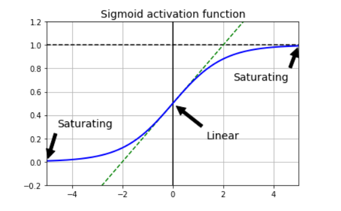
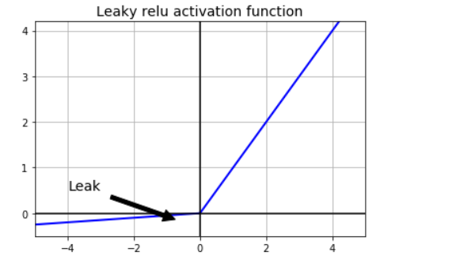
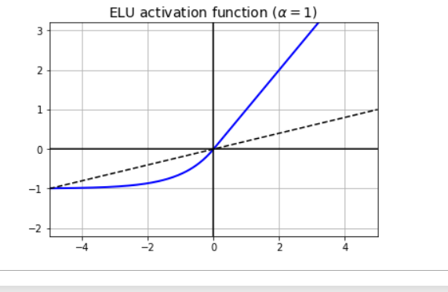
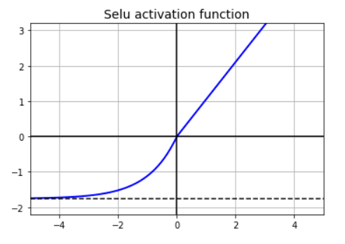
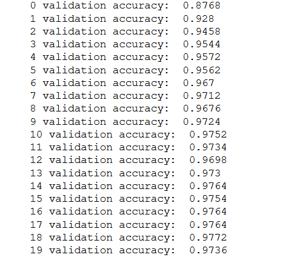
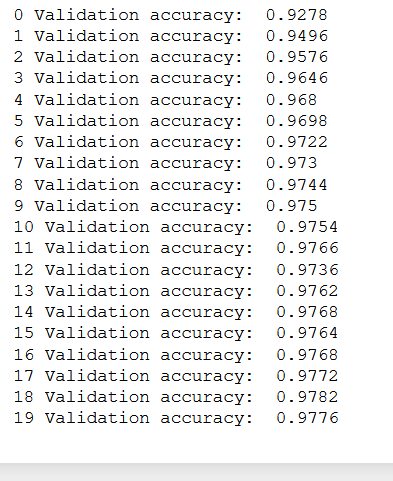
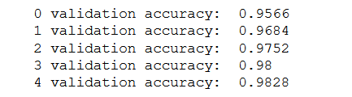
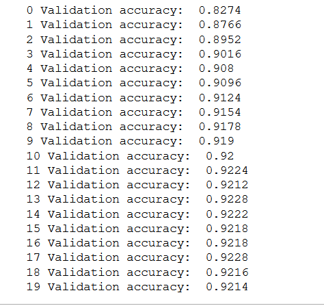
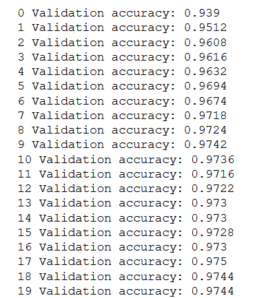

# Deep Neural nets

Problems with training a DNN:

    1. Vanishing gradients problem : gradients vanish at lower layer
    2. Larger thenetwork slower it is to train
    3. A model with a million parameters can overfit the network

## Vanishing gradients

gradients get smaller and smaller as algorithm reaches loewr layers seen with function with logistic activation
exploding gradients where the gradient become very big.

2010 paper Understanding the difficulty of training deep feedforward network

Xavier and He solution to disappearing gradients problem
1. We need to ensure that variance of inputs is equal to the variance of the outputs
2. Gradients should have equal variance before and after flowing through a layer in the reverse direction
3. For this to happen the input and output initialisations must be the same

The proposed a Xavier initialisation or glorot initialisation where weights are initilaised randomly.

fully_connected() function uses xavier initialisation, which can be chagned to a He initiliser

He initilisationconsiders only fan in not the average betweenfan nin and fan out. This is the default for variable_scaling_initialiser() function 

##  Non saturating activation function

ReLu was much better tahn sigmoid activation because:

1. It is faster to compute
2. It doesn't saturate for positive values

But they also suffer from dying relu problem: 
    some neuron only output 0
so we introduce a concept of leaky relu leaky reulu is F(x) =  max(alpha *z, z) 
The hyperparamter alpha defines how much the function "leaks": it is the slope ofthe function for z < 0 and is typiclaly set at 0.01
This small slope ensures that they never die. THey goto a deep coma but they
never die. They have a chance to eventually wake up.

In fact setting alpha = 0.2 performed better than samll leak of 0.01

Randomised leaky relu (RReLU) where alpha is picked randomly in a given range and fixed to a aerage value during training. 

Parametric leaky ReLU (PReLU) where alpha is authorised to be learned during training (instead of being a hyperparameter, it becomes a parameter). It outperforms the smaller.

ELU - exponentail Linear unit ouperformed Relu

1. It takes on negative values when z < 0 which allows the output to be closer to 0
It helps alleviate the vanishing gradients. lapha is usaully set at 1

2. It has non zero gradient for z<0 thus dyunig units issue is avoided

3. It is smooth everywhere including z<0

The manideawback is it is slower to compute bbut durin gtraining it has faster convergence rate. at test time elu is lower

for deep neural networks:
ELU > leaky RElu > Relu > tanh > logistic

There is something called SELU which is even better.

## Batch Normlisation

It is given as a solution to exploding graidents.
In this we add an operation to model just before ativation function of each layer,simpy centring and noramlising the inputs, then scaling andshifting the result. It lets you find the optimal scale and mean of inputs of each layers.

inorder to zero center and normalise the algorithm needs to estimate the mean and standard devaition. I evaluated the mean and standard devaition
At test time, we use the entire mean and standard devaition since mini batch is not available

Batch normailisaation removes the need because it add complexity but noramlisation is not needed

It takes in a zero centered and normalised input, then scales and shifts it.

Run time prediction is slower.

training parameter in batch normalisation, if not set then the tensorflow will only return a set of operations that we need to runfor ourseleves.

batch_norm() by default only centers, normalizes and shifts the inputs it does not scale them , this makes sense for layers with no activation function or with relu since the next layer weight can be used for scaling but for other activation function we need to add "scale" : True to btn_paramas.

argscope() can be used instead of repeatedly declaring the same variables

Rest of the construction is defininf cost function, creating an optimizer, telling it to minimize the cost function, defining the evaluation operations, creating the Saver etc.

during execution we need to set the is_train placeholder true or false with batch norm layer

##  Gradient clipping 

A way to lessen the exploding gradients problem is to clip the gradients during back propogation so that they never exceed some threshold this is used in recurrent neural network. People prefer Batch normalisation to gradient clipping in most other kinds of neural network.

In tensorflow the optimizers minimize () function takes care of both computing the gradients and applying them, so instead we must call optimizers compute_gradients () methodfirst, then create an operation to clip the gradients using clip by value() and finally apply the clippped gradients using the optimzersapply_gradients() method this is the trainind op. ans this will run at every training step. 

threshold is also a hyperparameter we can tune.

### Reusing pretrained layers

When we reuse the lower layers of the network it is called transfer learning.
We should try and reuse the parts of network, if the input is not same as the onews used in original task we will have to add a preprocessing step to resize them to the size expected.

If the input to the exisitng modeldon't have the sameinput parametersthen we add a preprocessing layer.

When we restore a model frim memory we can define the scope to get only the later we need. arg_scope().

We needto create a dictionary mapping each variable in original model . Wecreate another Saer to load the parameters. FInally we train on  a new task and saveit

The more the similarthe tasks are the more we want to reuse starting with lower layers.For very similar task we only changethe output layer

### basics

loss function : signifies thecost of a predcition, the more wrong the prediction the higher the loss
activation function: so that the output is changed to a more mangeable value
OPtimisers: provides a simpler way to train using the cost function

### reusingcode from other frameworks

If the model was trained using another framework, we need to load the weights manually, then assign them apropriate variables. (for eg in case of theano) This is tedious.

### Freezing the lower layers

We can fix the lower layer weights which we need not change by excluding those layers when defining the optimizers.

cAchingthe frozen layers: its possible to cache the output of topmost layer which actuallyproduces a huge speeedboost As we would need to frozen layer once per training instances

In training instead of building batches of training instances, we just build batches of outputs from hidden layer 2 and feed them to the training operation:
If we give tenorflow the output of hidden layer 2 it won;t try to evaluate it or any node it depends on

### Tweaking, Dropping or Replacing the Upper Layers

The principle is we need to train modelby freezing the upper layes and slowing unfreezing it and checking if accuracy improves. We can also iterate until we find the right number of layers to reuse, if we have plenty of training data we can try replacing the top hidden layers instead of dropping them and even add more layers

## Model Zoos

Places to check for model on tasks that you need
1. YOur own models
2. tensorflow models; VGG, INCEPTION and ResNET
3. CAFFE model zoo. 

## Unsupervised pre- training

If we don't have much labelled data and cannot find a model, then we can opt for unsepervised pretraining.
We can use a unspervised feature detector such as Restricted Botlzmannn Machines or autoencoders.

### Pre-training on auxillary task

One other last resort is to train the neural network on an auxillary task which is similar to the original objective. Max margin learning: when we assign a cost function such that good guess cost function is less than bad guess.

## Faster optimizers

It is foound that we should almost always use Adam optimisation

### Momentum optimisation

while gradient takes one step at a time and doesnot care about the previous gradients , however momentum optimisation adds to the local gradient a momentum vector. gradient is used as n acceleration with addition of new hyperparameter beta set between 0 and 1.
m = beta * m + ita * delJ(theta)
theta = theta -m

Momentumoptimisation is often useful in data with different scales. Momentum hyperparameter beta value of 0.9 works well in practice.

### Nesterov Accelerated Gradient

One small variant is NAG, in which the gradietn of cost function is not calculated at the present local position bu tsomepoistion in the future. momentum is measured in theta + beta * m rather than just theta.

m = beta * m + ita * delJ(theta + beta * m)
theta =  theta - m

### AdaGrad

Gradient Descent goes quickly down the steepest slope,  then slowly to the bottom of the valley. This is achieved in AdaGrad by scaling down the gradient vector along the stepest direction

s = s + delJ(theta) x delJ(theta)
theta = theta - ita * delJ(theta) x root(s + epsilon)

X means element wise multiplication . s accumulates the squares of partial derivative of the co,second step is just like gradient descen texept the gradient vector isscaled down by a fator of root(s _ epsilo)

It decays the learning ratebut faster for steep dimension tahn slow dimension

Only useful for simple operations

### RMSprop

RMSprop is an improvement over Adagrad by accumulating only the gradients from most recent iterations instead of all since the beignining of training

### Adam optimisation

Adaptive moment estimation, coombines the idea of momentum optimisation and RMSprop: it keeps tracj of momentum and like rmsprop it takes track of exponentialy decaying average past squared gradients:
m =  beta1* m + (1-beta1) * delJ(theta)
s = beta2 * s + (1-beta2) * delJ(theta) * delJ(theta)
m = m / (1-beta1T)
s = s/ (1-beta2T)
theta = theta - ita * m * root(s + epsilon)

T stands for iteration number

Beta1 is intialised to 0.9 and beta2 to 0.999,esiplon to 10 ^-8

ita is given value of 0.001

All the optimisation technique only rely on first order partial derviatives Jacobians. The second order partialderivatives are called Hessians but these are really hard to apply. Also second order derivatives often don't fit in the memory.

### Training sparse models

We have been using dense we can also use sparse models, one way to achieve this is to set small weights to zero. We can also apply strong l1 regularisation.

We can also use Dual averaging.

## Learning rate scheduler

A learning rate id it too high the training may actually divere, if too low it takes a lot of time to converge.

We can have varible learning rate, the most common ones are

### Predetermined peicewise constant learning rate
    for example by estting learning rate to 0.1 then to 0.001 after 50 epochs
   
### Performance scheduling
    Measure validation error and reduce the learning rate just like early stopping

### Exponential scheduling
    Set the learning rate as dynamic ita (t) = ita(0) * 10 ^ -t/r

### Power Scheduling
    set the leaning rate to ita(t) = ita(0) *(1 + t/r) ^ -c
    c is usually set to 1, this is similar to exponential scheduling

Dynamic learning rate can be implemented easily by using exponential_decay() function. We just need a global step function and pass it to optimiser it will be automatically incremented

## Avoiding overfitting through regualrisation

with four parameters I can fit an elephent and with five I can make him wiggle his trunk. -  John von Neumann

With millions of parameters we can fit the whole zoo, but then it leads to overfitting
to stop it we have early stoppiing, l1 and l2 regularisation, dropout , max-norm regularisation and data augmentation

### Early stopping 

One way to evaluate is through setting validation points at regular intervals at every 50 steps and saving a winner, andrestoring the early winner snapshot

### L1 and L2 regularisation

One way is to simply add the resgularisation terms to the ost function. But this approach is not convenient for many layers. Tensorflow comes up with a better option. Many functions that create variables (such as get_variable() or fully_connected()) accept a *_regulariser function

### Dropout

Even the state of art ml models got a 1-2% accuracy imporvement by just using dropout. When a model already has 95% accuracy getting a2% accuracy means dropping the error rate almost 40 percent.

The algorithm is pretty simple. At each training step, every neuron has a probability of p of being dropped, meaning at this training step it will be ignored and may be used in future training. The hyperparamter P is called the dropout rate typically set to 50 percent. After training the neurons don't get dropped anymore.

But to compensate for the testing part we need to multiply each input connection weight by the keep probability (1-p) after training.To implement dropout using tensorflow we can simply add the dropout() function to the input leayer and the output of every hidden layer.

### Max norm regularisation

For each neuron it constrains the weight w of the incoming connection such taht ||w||2 <= r where r is the max-norm hyperparameter and l2 normm is used we compute w2 and clipping if needed

w is updated as w = w * r / ||w||2

Reducing r increases the amount of regularisation

### Data augmentation

IT the art of creating artificial training sets

## Guidelines

1. initialisation = He
2. activation = ELU
3. normalisation = Batch normalisation
4. regularisation = dropout
5. optimizer = Adam
6. learning_rate_schedule = None

1. if you can find good learning rate, learning_schedule with decay can be used
2. Id training set is too samll we can implement data augmentation
3. for sparse model we can add l1 regularisation we can use FTRL for even sparser oprimisation
4. Leaky relu for fast model at runtime, having a sparse model will help

# Exercises

1. No if the initialisation is same then the entire model will remain the same. That is each layer will behave like having one neuron
2. It is perfectly fine to keep biases to zero
3. Advantages of ELU : 
    1. It can take naegative values, alleviates vanishing gradients
    2. Can never have vanishing gradients
    3. It helps alleviate the dying units issue
    4. It is smooth everywhere
4. ELU - it is a good default
    leaky RELU - forfaster convergence
    RELU -IT precisesly outputs zeo which is useful
    tanh - can be used if you need an output between -1 ans 1
    logistic - variational autoencoders use them
    softmax - multiple mutually exclusive classes
 5. Momemtum parameter will decide on speed of MomentumOptimizer,it might take longer to convere because it shoots out from the minimium
 6. Producing a sparse model with most wights equal to zero , we can apply l1 regularisation, train the model noramlly then zero out tiny weights, using dual averageing using tensorflow FTRLOptimizer class
 7. Dropout do slow down traning, it has no effect on inference since it is turned

