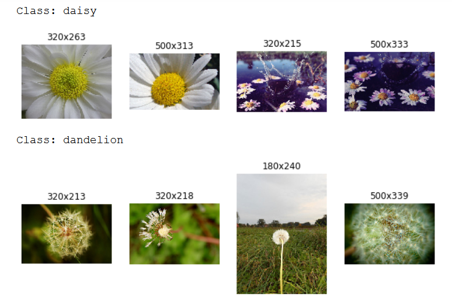
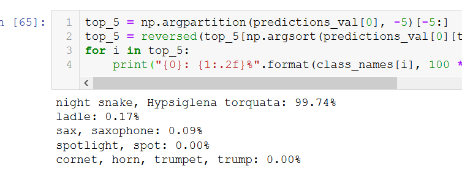

CNN - convolution neural nertwork are also used for voice recognition and natural language processing (NLP). LeNet was used or handwriting recognition.
If we uses simple deep network for recognising pictures it wont work unless the dataset is mnist. 

The convolutionalneurak network : The convolutional layer neurons in the first convolutional layer are not connectedto evey single image in the output image but only to the pixels in their receptive fields. This architecture helps the network to concentrate  on low level features in the first hidden lyer, then assemblethem into  a higher  level feature

A convolution is a mathematical operation that slides one functionover another and measures the integral of thwir pointwise multiplication,It has deep connections with fourier transform and laplace transform.

Each layer is represented in 2D.

A neuron located in row i, column j of given layer is connected to the output of rows i + fh -1 columns j to j + fw - 1 where fh and fw are the height and width of receptive field. In order for a layer to have same shape then we must use padding. Also called zero padding. 

It is also possible toconnect to large input layer by spacing our receotive fields, the distance between convolutional network is called a stride.

### Filters

A neuron's weights can be represented as a samll image of size of receptive filed. There can be filters , fitrst one is a black square with vertical whiteline in the middle ( 7 * 7 matrix with 0s with onlyonw in middle), the subsequent layer will igonre everytnif but tbe 1s

### Stacking multiple Feature maps

A cnn is actually 3D this is handled though conv nets, within one feature map the neurons share parameter this heos inredu. This helps in dramatically reducing the number of parameters

### Tensorflow implementation

In tensorflow each input image is typically represented as  3D tensor of shape (height, width, channels) a mini batch as 4D tensor of size , height , width and channels The weights represented by fh, fw, fn , fn' The bias as [fn]

when filter has all zeros:

###  memory requirement

CNNs require a huge amount of RAM especially ditong train, because reverse pass of backpropagation requires all the intermediate values computed during forward pass

During inference i.e when making predictions for a new instance the RAM occupied by one layer can be released as soon as the next layer has been computed, so we need as much ram as required by two consecutive layers

rducing mini batch size can reduce memory needed, also dimensionality of strides  or removing some layer, we can also use 16 bit floats instead of 32 bit floats, we can distribute the CNN accross multiple devices

### Pooling Layer

Their goal is to subsample (i.e. shrink) the input image in order to reduce the computational load, the memry usage the number of parameters (Therby limiting overfitting) Reducing the input image size also makes the neural network tolerate a little bit of image shift (location invariance)

Like in convolutional layers each neuron in a pooling layer connected to the outputs of a limited number of neurons in the previous layer, located within a small rectangular receptive field We must define its size padding type and stride, however a pooling neuron has not weights it just aggregation function like max or mean.

## CNN Architectures

Typically we stack a few convolutional layers (Each one generally followed by a ReLU layer) Then a pooling ayer, then another few convolutional layers then another pooling layer and so on

Image get smaller and smaller as it rogresses through the network but also gets deeper and deeper thanks to the convolutional layers. At the top of the stack a regular feed forward neural network is added , composed of a few fully connecred layer (+ReLU) and the final layer outputs the prediction

A common mistake is to use a convolution kernel that are too large, we get the same effect as a 9x0=9 kernel by stacking two 3x3 kernels on top of each other for lot less computation

Over the years the variants of this fundamental architecture have been developed. We will look at LeNEt and AlexNet , GoogLeNet and ResNet

There was stunning progress as wellas in the other visual tasks such as object detection and localisation and image segmentation. In object detection and localisation the neural network typically otputs a sequence of bounding boxes and various projects int he image. For example in Maxine Oquab et al 2015 paper that outputs a heat map for each object class or Russel Stewart 2015 paper to detect faces anda recurrent neural network, and in iamge segmentation Evan Schelhamer et al's 2016 paper

### LeNet-5

Most widely knon CNN architecture. Created by Yann LeCunn in 1998 and widely ised for handwriting trcognition (MNIST)

MNIST images are 28 x 28 pixels but they are zero padded to 32 x 32 pixels and normalised before being ffed into the network, the average pooling  layers are slightly more complex thatn usual each neuron computest the mean of its inputs then multiplies the result by a learnable coefficient and adds a learnable bias term, then finally applies the activation function

Most neurons in C3maps are connected to neurons in only three or four S2 maps instead of all size S2 maps 

The output layer is a bit special: instead of computing the dot product of input and weight vector each neuron ouputs the square of Euclidean distance between its input vector and its weight vector, the cross entropy cost function is now preferred as it penalizes bad predictions much more producing large gradients and thusconverging faster

### AlexNet

AlexNet CNN Architecture won the 22012 ImageNet ILSVRC challenge by a large margin it achieved 17 % top -5 error rate while the second best achieved only 36 %, similar to lenet 5 but much deeper 

To reduce overfitting the authors used two regularisation techniques we discussed inprevious chapters: Firstthey applied dropuot during training to the outputs of layers F8 and F9 second they performed data augmentation by randomly shifting the training images by various offsets, flipping them horizontally and changing lighting consitions

Also used a competitive normalisation step right after ReLU called local response normalisation. This form of mormalisation that most strongly activate inhibit neurons at the same location but in neighbhoring feature maps This encourages different feature maps to specialize , psuhingthem apart and forcing them to explore a wider range of features

ZFnet was tweaked version of AlexNet

### GoogLeNet

Network was much deeper than previous CNNs. This was made possible by sub networks called inception modules, which allow GoogLeNet actally has 10 times fewer parameters than AlexNet (Roughly 6 million instead of 60 million)

They use and inception modules with 1x1 kernels too. These serve a purpose
1. First they are configured to output many featires maps than their inputs so they serve as bottleneck layers meaning they reduce dimensionality. This is partocularly usefulbefore the 3x3 layers

2. Each 1x1 and 3x3 or 5x5 together acts as a powerful convolutional ayer, capable of capturing more complex patterns, indeed instead ofsweeping a simplelinear classifier across the image, this pair of convolutional layers sweeps a two layer neural network accross the image

In short you can think of the whole inception module as a convolutional layer on steroids able to output feature maps that capture complex patterns at various scales

No. of convolutional kernels for each convolutional layer is also a hyperparameter

### ResNet

errorrate of only 3.6 % using an extremely deep CNN composed of 152 layers. , suing skip conection. When we skip connecton then the target function beomes f(x) = h(x) - x rahter than just h(x)

ResNet-34 is the ResNet with 34 layers (only ocunting the convolutional layers and fully connected layer) containing three residual units that output 64 feature maps 4 RUs with 128 maps , 6 RUs with 256 maps and 3 Rus with 512 maps

ResNets deeper than that such as ResNet-152 use slightly different residual units. insted of two 3 x3 convolutional layerswith 256 feature maps they use three convolutional layers a 1 x 1 convolutional layer with just 64 feature maps which act as a bottleneck layer then a 3 x3 layer with 64 feature maps and finally another 1x1 convolutional layer with 256 feature maps that resotres the original depth. ResNet-152 contains 3 such RUs that output 256 maps then 8 RUs with 512 maps a whopping 36 RUs with 1024 maps and finally 3 RUs with 2048 maps

### Tensorflow convolution operations

1. conv1d() creates a convolutional layer for 1Dinputs. This is useful for example in antural language processing where a sentence may be represented as a 1D array of words and receptive field cover a few neighbhoring words

2. Conv3d() creates a convolutional layer for 3D inputs such as 3D PET scan
3. atrous_conv2d() creates an atrous convolutional layer with holes this is equivalent of using a regular convolutional layer with dilated inserting rows and columns of zeros for example [1,2,3] converts to [1,0,0,2,0,3] post dilation

3. conv2d_transpose() creates a transpose convolutional layer which upsamples an image It dows so by inserting zeros between inputs so you can think of it as a convolutinal layer usng fractional stride. Useful in image segmentation

4. depthwise_conv2d() creates a depth wise convolutional layerthat applier every filter to every individual channel independently

5. seperable_conv2d() creates a seperable convolutional layer that first cts like a depthwiseconvolutional layer then applies a 1x1 conv layer to the resulting feature maps

### Exercises

1. advantages of CNN over DNN:
    consecutive layers are only partially connected because it reuses weights CNN has many fewer parameters than a fully connected DNN which makes it much faster to train, reduces the risk of overfitting
    
   when a CNN has learned a kernel it can detect a particular eature it can dtect that feature anywhere on image, since image has typically repetivite features CNN are able to generalise better
   
   DNN has no knwledge of how pixels are organised it does not know that newarby pixels are close. A CNN's arcchitecture embeds this prior knowledge. Lower layers typically identify features in small areas of the images, while higher layers combone the lower levle features into larger features. this works well with most natural images giving CNNs a decisive head start
   
2. A CNN of 3 x 3 kernels, a stride of 2, SAME padding. The lowest layer outputs 100 feature maps, middle one 200 and te top outputs 400. input images of 200x300 pixels.

What is the total number of parameters?
3x3 kernels inputs channel has rgb so 3x3x3 plus a bias term, thats 28 parameters per feature map, since it has 100 feature map, 2800 parameters
Second convolutional layer has 3x3 kernels and its input is the set of 100 feature maps of the previous layer, so eachfeature map has 3x3x100 = 900 weights plus a bias term , since middle has 200 so 901 x 200 = 180,200 parameters, finally the last layer has 3x3 kernels and input is a set of 200 feature map, since it has 400 feature maps the layer a total of 1801 x 400 = 720,400 parameters all in alll the CNN has 2800 + 180200 + 720400 = 903400 parameters

with 32 bt floats what is the memory of RAM ?
if we are using a stride of 2 with SAME padding, the horizontal and the vertical  size of the feature map is devided by 2 at each layer, the input channels are 200x300 picels the first layer feature map would be 100x150, second layer 50x75, third layer 25x38. Since 32 bits is 4 bytes and the first convolutional layer has 100 feature maps this layer takes up 4 x100 x 100 x150 = 6 million bytes(5.7 MB) second will take 4 x 200 x50 x75  = 3 million (2.9 MB) and third layer takes up 3 x 25 x 38 x 400 = 1.4 MB, so total beign 14.3 MB, and adding the memoryby CNN parameters 3,623,600 bytes(3.4 MB) the total ram required being about 17.8 MB

how about minim batch of 50 images?
on a mini batch of 50 images , so the ram required would would be 10 MB x 50 = 500 MB , RAM for input images = 50 X4 x200 x 300 x3  = 34.3 MB and 3.4 for model paramerters it comes out to be 537.7 MB (very optimistic bare minimum)

3. If GPU runs our then there are five things you can try to solve the problem:
    1. Reduce the mini-batch size
    2. Reduce dimensionality using a lrger stride in one ormore layers
    3. Remove one or more layers
    4. Use 16 bit floats instead of 32 bt floats
    5. Distribute the CNN accross multple devices

4. maxipooling has no parameters at all
5. A local respones normalisation layer makes the neuron  taht most strongle activate inhibit neurons at the same location but in neighbhoring feature maps which encourages different feature maps to specialize and pushes them apart forcing themto explre a wider range of features

6. The main nnovation of Alexnet compared ot Lenet are its much larger and deepser and it stack convolutional layer directly on top of each other without a stacking pooling layer on top of each convolutionallayer the main innovation of GoogLeNet is the introduction of inception modules whcih make it possible ot have a much deeper net than precious CNN architectires with fewer parameters , Finally resnet main innovation is the skip connection which made it possible to go well beyond the 100 layers, Arguably its simplicity and consistency are very innovative.

8. Using inception v3

1. On this pooer animal, known as fasso:

    with disastrous results:
   

2. On flower dataset:

    

