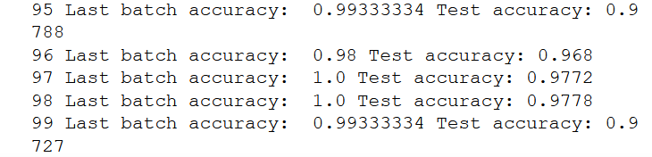
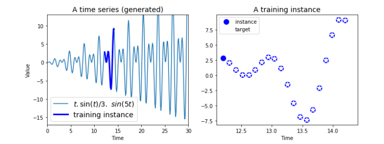
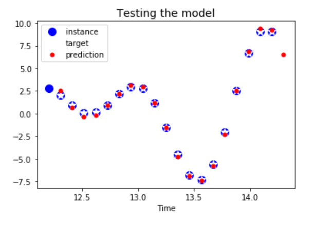
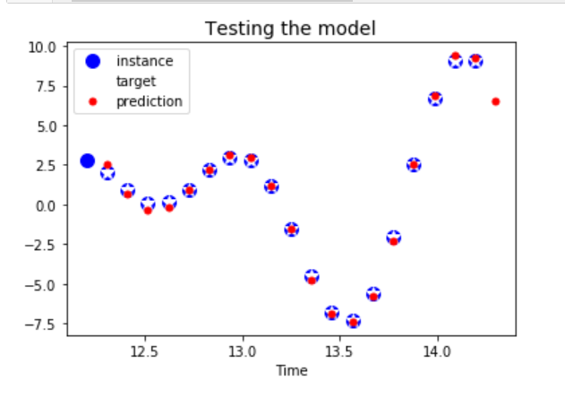
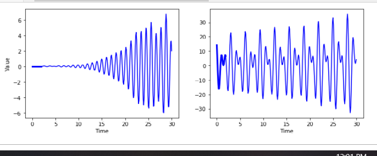
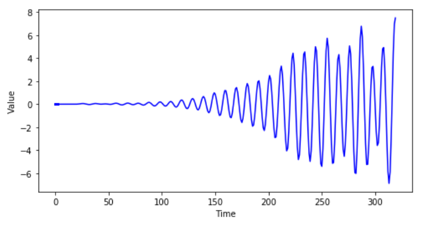
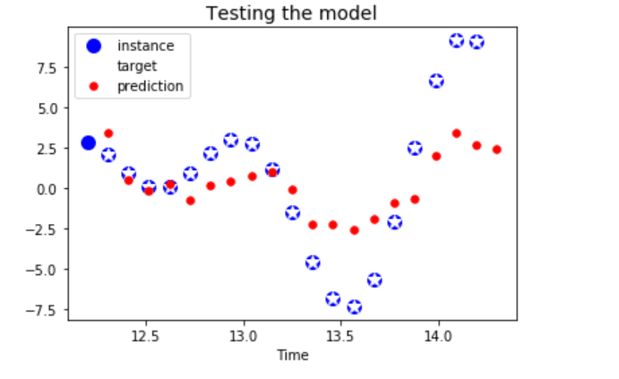
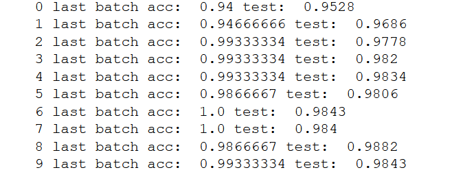

### Recurrent Neurons

Feedforward network : activations in one direction (forward)
A recurrent network also has connection backwards. 
A recurrent neuron recieves input x at time t and output of time t - 1
Representing a network through time is called unrolling of the network

lets take wx and wy to be the weight sof input and previous output
Then the output of rnn is 
y(t)= hypothesis(x(t).T.wx + y(t-1).T.wy + b)

=> Y(t) = hypothesis(|X(t) Y(t-1|. W + b) where W = |Wx Wy|.T

Y(t) is the m x neurons matrix containing the layers output at time step t foreach instance in the mini batch

X(t) is the m x ninputs matrix containingthe inputs for all instances

Wx is an ninputs x nneurons matrix contaiing the connection weights for the outputs of previosu times step

Wy is an neurons x neurons matrix containing the connection weights for the output of the previous timestep

The weight matrix Wx and Wy are often concatenated into a single weight matrix W of shape (ninputs + nneurons) x nneuorns 

b is a vector of size nneirons containing each neirons bias term

### Memory cells

Ouput of a recurrent neuron at time step t is a function of all the inputs from the previous time steps, oyu could say it has a form of memory. A part of neural network that preserves somestate accross time steps is called a memory cell. A single recurrent neuron or a layer of recurrent neurons is a very basic cell.

The cells state at time step t denoted h(t) is a function of some inputs at that time step and its state at the previous time step. Its output at time step t denoted y(t) is also a function of th eprevious state and the current inputs.

### Input and output sequences

A RNN can simultaneosly take a sequence of inputs and produce a sequence of outputs. For example this type of networ is useful for predicting time series such as stock prices:you feed it prices over the last N days and it must output the prices shifterdby one day into the future.

Alternatively you couldfeed the networkasequence of inputs and ignore all outputs except for the last one. For exampleyou couls feed the network a sequence of words corresponding to a movie reviewand network wouldoutput a sentiment score 

Conversely we can feed the network a single input at first time step ans let it output a sequence ithis is a vector to sequence network.

We also can have a sequence to vector network called an encoder followed a vector to sequence network called a decoder.this is used for tanslation of one network to another. Works much better to translate on the fly.

## Basic RNNs in TensorFlow

Basic rnns are defined using tf.nn.rnn.BasicRNNCell() in tensorflow followed by a static_rnn() or a dynamic_rnn() call to create the cells.

In static_rnn() is basically writing one function multiple times through time steps creating a very large graph, which is suspectible to out of memory errors its better that we use dynamic_rnn()uses a while_loop() operatin to ru over the cell the appropriate number of times and you can set sqap_memory=True if you want to swap the GPU memory to CPU memeory during backpropagation to avoid OOM errors

Also in dynamic rnn there is no need to stack unstack and transpose
so its much better than staic_rnn().

### Using variable length input sequences

when we are not aware of sequence length (like in case of sentences) we put sequence_length as a parameter when we define dynamic_rnn()

If one of the inputs doesnt have requisite values then it is padded and also in states val this padded zero step is excluded

### Handling the variable length output Sequences

This is done ussially through End of Sequence tokens

### Training a RNN 

Training is done by backpropagation just liek we do normally however but under the hood the technique used is BPTT (Backpropagation through time)

The gradients flow based on cost function use in the evaluation of cost. There is some ambiugity on how exactly the cost function is calculated.

Using on MNISt dataset

We can specify an initializer for the RNN by wrapping its construction code in a variable scope (egs variable_scope("rnn", intializer=variance_scaling_initializer(), to use He initialisation))

## Predicting time series

A time series is a randomly selected sequence of 20 consecutive values from the time series and the target sequence is the same as the input sequence exceptit is shifted one step into the future.

Example are stockprices, air temprature and brain wave patterns.

using this series for predictions by creatinga  RNN, this RNN conatins 100 recurrent neurons and we willunroll it over 20 time steps since each trainng instance will be 20 inputs long.

The target is also sequences of 20 outputs each containing a single value.

generally there are more than one input feature.

At each time step now we have an output vector of size 100. But what we actually want is a single output value at each time step

This can be done in two ways 

1. wrapping with a output projection wrapper: it acts like a normal cell, but it also adds some functionality. It adds a fully connected layer of linear neurons (i.e. without any activation function) on top of each output (but it does not affect the cell state) it adds afully connected layer of neurons that is without any actucation function on top of each output (but it does not affect the cell state)

2. We can also jsut simpleadd a fuly connected layer on topmanually.
This is trickier but more efificient solution
We can reshape the RNN outputs from [batch_size, n_steps,n_neurons] 

to [batch_size * n_steps, n_neurons]then apply a single fully connected layer, with the approporiate output size . Which wil result in a tensor of shape batch_size * n_steps, n_outputs. Then reshape this tensor to batch_size, n_steps and n_outputs

### Creative RNN

We have amodel that can predict the future, we can use it to generate some creative sequences. All we need is to provide it a seed sequence containing n_steps values (eg fill og zeros) and then use to poroduce the next value

given a randomly initialised wave form:

the further generated iteration:

### Using dropouts

### LSTM

