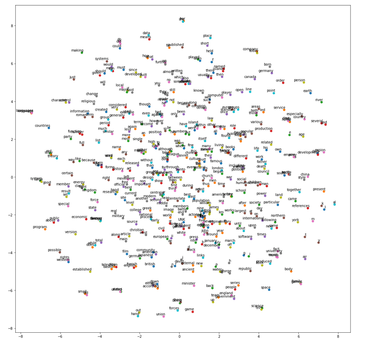
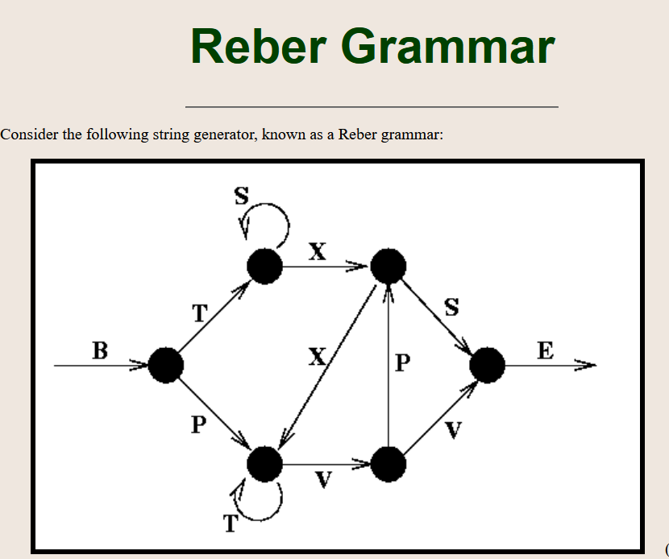
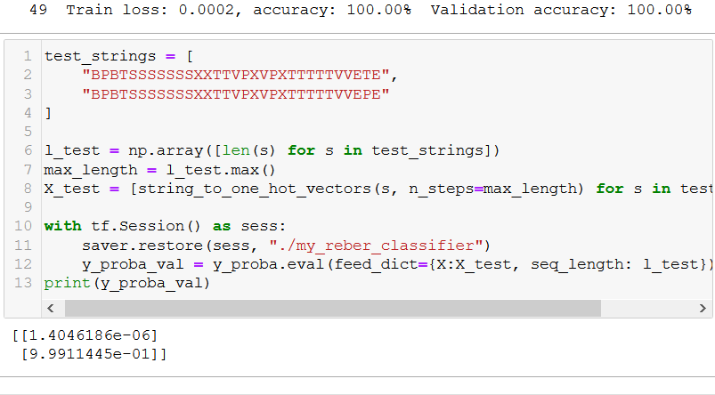

### Recurrent Neurons

Feedforward network : activations in one direction (forward)
A recurrent network also has connection backwards. 
A recurrent neuron recieves input x at time t and output of time t - 1
Representing a network through time is called unrolling of the network

lets take wx and wy to be the weight sof input and previous output
Then the output of rnn is 
y(t)= hypothesis(x(t).T.wx + y(t-1).T.wy + b)

=> Y(t) = hypothesis(|X(t) Y(t-1|. W + b) where W = |Wx Wy|.T

Y(t) is the m x neurons matrix containing the layers output at time step t foreach instance in the mini batch

X(t) is the m x ninputs matrix containingthe inputs for all instances

Wx is an ninputs x nneurons matrix contaiing the connection weights for the outputs of previosu times step

Wy is an neurons x neurons matrix containing the connection weights for the output of the previous timestep

The weight matrix Wx and Wy are often concatenated into a single weight matrix W of shape (ninputs + nneurons) x nneuorns 

b is a vector of size nneirons containing each neirons bias term

### Memory cells

Ouput of a recurrent neuron at time step t is a function of all the inputs from the previous time steps, oyu could say it has a form of memory. A part of neural network that preserves somestate accross time steps is called a memory cell. A single recurrent neuron or a layer of recurrent neurons is a very basic cell.

The cells state at time step t denoted h(t) is a function of some inputs at that time step and its state at the previous time step. Its output at time step t denoted y(t) is also a function of th eprevious state and the current inputs.

### Input and output sequences

A RNN can simultaneosly take a sequence of inputs and produce a sequence of outputs. For example this type of networ is useful for predicting time series such as stock prices:you feed it prices over the last N days and it must output the prices shifterdby one day into the future.

Alternatively you couldfeed the networkasequence of inputs and ignore all outputs except for the last one. For exampleyou couls feed the network a sequence of words corresponding to a movie reviewand network wouldoutput a sentiment score 

Conversely we can feed the network a single input at first time step ans let it output a sequence ithis is a vector to sequence network.

We also can have a sequence to vector network called an encoder followed a vector to sequence network called a decoder.this is used for tanslation of one network to another. Works much better to translate on the fly.

## Basic RNNs in TensorFlow

Basic rnns are defined using tf.nn.rnn.BasicRNNCell() in tensorflow followed by a static_rnn() or a dynamic_rnn() call to create the cells.

In static_rnn() is basically writing one function multiple times through time steps creating a very large graph, which is suspectible to out of memory errors its better that we use dynamic_rnn()uses a while_loop() operatin to ru over the cell the appropriate number of times and you can set sqap_memory=True if you want to swap the GPU memory to CPU memeory during backpropagation to avoid OOM errors

Also in dynamic rnn there is no need to stack unstack and transpose
so its much better than staic_rnn().

### Using variable length input sequences

when we are not aware of sequence length (like in case of sentences) we put sequence_length as a parameter when we define dynamic_rnn()

If one of the inputs doesnt have requisite values then it is padded and also in states val this padded zero step is excluded

### Handling the variable length output Sequences

This is done ussially through End of Sequence tokens

### Training a RNN 

Training is done by backpropagation just liek we do normally however but under the hood the technique used is BPTT (Backpropagation through time)

The gradients flow based on cost function use in the evaluation of cost. There is some ambiugity on how exactly the cost function is calculated.

Using on MNISt dataset

We can specify an initializer for the RNN by wrapping its construction code in a variable scope (egs variable_scope("rnn", intializer=variance_scaling_initializer(), to use He initialisation))

## Predicting time series

A time series is a randomly selected sequence of 20 consecutive values from the time series and the target sequence is the same as the input sequence exceptit is shifted one step into the future.

Example are stockprices, air temprature and brain wave patterns.

using this series for predictions by creatinga  RNN, this RNN conatins 100 recurrent neurons and we willunroll it over 20 time steps since each trainng instance will be 20 inputs long.

The target is also sequences of 20 outputs each containing a single value.

generally there are more than one input feature.

At each time step now we have an output vector of size 100. But what we actually want is a single output value at each time step

This can be done in two ways 

1. wrapping with a output projection wrapper: it acts like a normal cell, but it also adds some functionality. It adds a fully connected layer of linear neurons (i.e. without any activation function) on top of each output (but it does not affect the cell state) it adds afully connected layer of neurons that is without any actucation function on top of each output (but it does not affect the cell state)

2. We can also jsut simpleadd a fuly connected layer on topmanually.
This is trickier but more efificient solution
We can reshape the RNN outputs from [batch_size, n_steps,n_neurons] 

to [batch_size * n_steps, n_neurons]then apply a single fully connected layer, with the approporiate output size . Which wil result in a tensor of shape batch_size * n_steps, n_outputs. Then reshape this tensor to batch_size, n_steps and n_outputs

### Creative RNN

We have amodel that can predict the future, we can use it to generate some creative sequences. All we need is to provide it a seed sequence containing n_steps values (eg fill og zeros) and then use to poroduce the next value

given a randomly initialised wave form:

the further generated iteration:

### using differnet GPUs

The only way to achive taht is to use u=your own cell wrapper

### Using dropouts

If we want to apply dropout between the RNN layers then we need to use a DropoutWrapper. The following code applies dropout to the inputs of each layer in the RNN, dropping each input with a 50 percent probability.

### The difficulty of training over many time steps

To train an ENN on long sequences , we will need to run it over many time stwps making the unrolled RNN a very deep network, and it will suffer frim vanishing / exploding gradients problem.  Training would e slow even with the normal techniques like good parameter initialisation, non saturating activation functions, batch normalisation, gradient clipping and faster optimizers

The simplest solution is to unrll the RNN over a limited number of time steps. Thisis called truncated backpropagation through time.

Another problem is that memory slowly fades away. Of the first cell.
That is why LSTM is proposed.

### LSTM

LSTM intensorflow is used by simple BasicLSTMCell insteadof BAsic RNN cell.

        LSTM is composed of two states short term state h(t) and c(t) the long term state. c(t-1)when it traverses the network from left to right it goes through a forget gate, and then adds somenew memory by addition then c(t) is sent straight out. after Addition operation the long term state is copied and passed thorugh tanh function and the result filtered by output gate.This produces short term state h(t). (Which sequalto cells output forthis time step y(t))

        Where new memories come from and how the gates work.

        First the current input vector xt and previous shotterm state is fed into four different fully connected layer

        1. The maun layer outputs gt. It has the usual role of analysing the currrent xt and previous ht-1 , in basic cell the output goes right outside however in LSTM it is partially stored in the long term state

        2. The three other layers are gate controller. Since theyuse the logistic activation function their outputs range form 0 to 1, 

        it has a forget gate - controlling which long term must be erased

        It has a input gater wich control weich parts of gt should be added to the long term stater the thing that was partially stored.
        and finaaly the output gate which controls parts of long term states to be read andoutput at this time step (bith ht) and yt

LSTM cell can to recognise and important input store it in longterm state and learn to preserve it as long as it is needed. And learn to extract it when required.

Peephole connections - it a basic LSTM cell the gate controllers can look only at the input xt and theprevious short term state ht-1 . It may be a good idea to let them take a peek so as to speak at the long term memory as well, its called peeholeconnections, the previous long term ct-1 is added as aninput to the connections of forget gate and the input gate.

Thereare many variants of LSTM one of which is GRU. It is simplified but performs equally well.

1. both state vectors are merged, one gate controller controls bith forget gate and input gate. If gate controller outputs a 1, input gate is opern and forget gater is closed.if 0 then opens.

2. Ther is no output gate the fill state vector is output at every step time step. HOwever the gate controller determines which part of previous stat will beshown to the main layer

### Natural Language processing

We look at old nemesis word embeddings 

Word embeddings 

How to represent them, one way is one hot encoding which is not only inefficient but also doesnt give any meaningful information

Ideally we want similar words to have similar representation, which makes it easier for model to generalize what it learns about a word to all similar words. so that it associates drink and water than drink and shoes.

We represent each word with samll and dense vector (150 vector) embedding, At begining of training embedding for each word is chosen randomly, but as training progresses back prpogation automaitcally moves the embedding in such a way that helpsneural network perform its task. Typically this means that similar words willcluster towards each other, and even end up in organised manner in a meaning full way.

Word embeddings after tsne

### Creating a decoder

For creating english to french translation encoder decoder model, The decoder while training is also given the french word a ttime of lookup.

starts at <go> token and ends at <eos> token.

The english sentences are reversed before they are fed into the encoder
So that beginning i the last thing in encoder, as it is the first thing machine needs to translate.

Each word is initialy represented by a simple integer identifier (eg 288 for milk). Next an embedding lookup returns the word embedding, these word embeddins are what is actually fed to the encoder and decoder

At each step decoder output a score for eacj word in output vocab and then the softmax layerturns these scores into probabilities. 

Note that at inference time (after training), you will not have the target sentence to
feed to the decoder. Instead, simply feed the decoder the word that it outputs.

Important things to keep in mind 
1. dynamic length of sentences
2. using sampoling technique toc create a smaller output feature set
3. An attention mechanism that lets decoder peek into input sequence
4. How to train it

# Exercises

1. Applications of RNN
    sequence to sequence:
    predicting the weather (or any other time series)
    machine translation (encoder decoder)
    video captioning 
    speech to text
    music generation (or any other sequence generation)
    idenitiying chords of a song
    
    sequecne to vector:
    music genre classification
    analysing the sentiment of a book review
    predicting what worda patien t is thing of based on reading from brain implant
    predicting probability that user will want to watch  amoviebased on watch history (collaborative filtering)
    
    vector to sequence:
    image captioning
    creatinga music playlist
    generatinga melody based on parameters
    locating pedestrians in a picture (in self driving car)
    
2. If translate a sentence one word at a time the resultwill be terruble
A plain seuqnce to sequence RNN wont do

3. To classify vide we take one frame per sec then run each frame through a CNN  feed the output to a rnn and run output to softmax layer  giving you the class probabilities. For training we would use cross entropy of the function
we can use this for audio classification as well you could convert every second of audio to a spectrograph feed this to a cnn and feed the output of a CNN to a RNN

4. Building a RNN using dynamic_rnn() over static has many benefirs
based on while_loop() operationt hat is able to sqp the GPU memort ro CPU memeory during backpropagation acoiding the out of memory errors. 
Easier to use
generatessmaller graph

5. To handle dynamic length of inputs we set  sequence length parameter
we can pad the inputsif not aware of the max length

6. To distribute the GPU over multiple GPU a common technique is to place each ayer in a different GPU

7. Reber grammar

In this we are trying to make a machien that can make reber grammar:

Reber grammar: 

### Things to do

findout 
1. how mnist works
2. how word embedding works
3. implement french translater
4. Know how the encoder of reber grammar works

