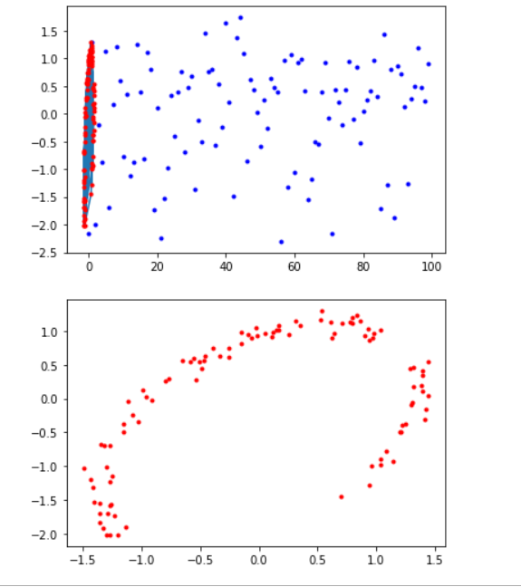
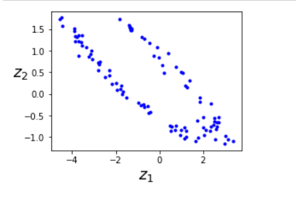
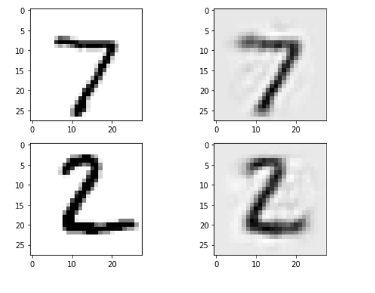
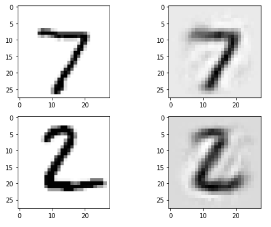
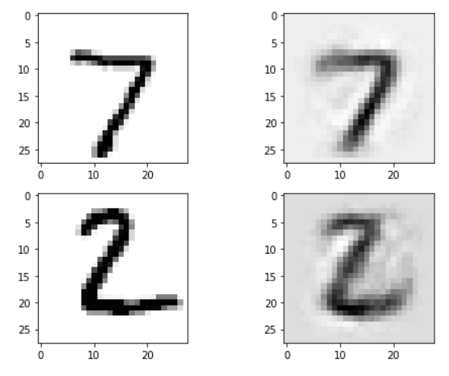
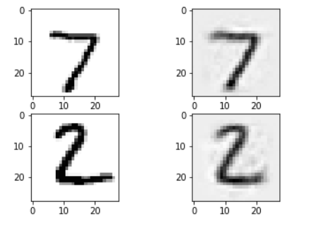

# Autoencoders

Autoencoders are artificial neural networks capable of learningeffiient representations of the input data, called codings without any supervision (i.e training set is unlabelled) 

These typically have lower dimensionality than the input data, so used in dimensionality reduction

These can be used for creating powerful feature detectors, and they can be used for unsupervised pretraining of deepneural networks.

These are capable of generating new data that looks similar to a generative model

These work by copying input to output, we can add nose or limit th esime of internal representation or we can add some noise to the inputs and train the network to recover the original inputs. These contrints prevent the autoencoder fromtrivial copying of inputs to outputs.

## Efficient data representation

Hailstone sequence : even nofollowed by half, off number followed by triple + 1
Autoencoder composed of two parts : encoder (recognition network), and decoder (generative network) that converts the internal representation to the outputs

Autoencoder has the same architecture as the multilayer perceptron, except the number of inputs must be equal to the number of outputs. Outputs are called reconstructions since the autoencoders tries to reconstruct the inputs and loss function contains a reconstruction loss that penalizes the model when reconstructions are different from the inputs

Because internal representationhas a lower dimensionality than th einput data ( it is 2D instead of 3D) the autoencoder is said to be undercomplete. An undercomplete autoencoder cannot trivially copy it inputs.

### simple PCA using autoencoder

If the autoencoder uses only linear activations and the cost function is the Mean Squared Error (MSE) then it can be shown that it ends up performing PCA

After autoencoder:

### reconstruction using auto encoder , stacked autencoder

Also called deep autoencoders, adding more layer hep it develop more complex codings. We should not make autoencoder too powerful otherwise it will create a paerfect copy of input data.

Foe example for mnist it would need input and output equal to 784 units while there can be 3 hidden layers

### Tying the weights

We can tie the weights if the autoencoder is perfectly symmetrical, This halves th enimber of wights speeeding the training and limiting the risk of overfitting

### Training One Autoencoder at a time

It is faster to train one shallow encoder at a time and then stack all using a single autoencoder

Simplest approach being using different tesnorflow graph:

Another approach is to use a single graphcontaining the whole stacked autoencoder, plus some extra operations

