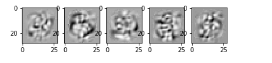

# Autoencoders

Autoencoders are artificial neural networks capable of learningeffiient representations of the input data, called codings without any supervision (i.e training set is unlabelled) 

These typically have lower dimensionality than the input data, so used in dimensionality reduction

These can be used for creating powerful feature detectors, and they can be used for unsupervised pretraining of deepneural networks.

These are capable of generating new data that looks similar to a generative model

These work by copying input to output, we can add nose or limit th esime of internal representation or we can add some noise to the inputs and train the network to recover the original inputs. These contrints prevent the autoencoder fromtrivial copying of inputs to outputs.

## Efficient data representation

Hailstone sequence : even nofollowed by half, off number followed by triple + 1
Autoencoder composed of two parts : encoder (recognition network), and decoder (generative network) that converts the internal representation to the outputs

Autoencoder has the same architecture as the multilayer perceptron, except the number of inputs must be equal to the number of outputs. Outputs are called reconstructions since the autoencoders tries to reconstruct the inputs and loss function contains a reconstruction loss that penalizes the model when reconstructions are different from the inputs

Because internal representationhas a lower dimensionality than th einput data ( it is 2D instead of 3D) the autoencoder is said to be undercomplete. An undercomplete autoencoder cannot trivially copy it inputs.

### simple PCA using autoencoder

If the autoencoder uses only linear activations and the cost function is the Mean Squared Error (MSE) then it can be shown that it ends up performing PCA

After autoencoder:

### reconstruction using auto encoder , stacked autencoder

Also called deep autoencoders, adding more layer hep it develop more complex codings. We should not make autoencoder too powerful otherwise it will create a paerfect copy of input data.

Foe example for mnist it would need input and output equal to 784 units while there can be 3 hidden layers

### Tying the weights

We can tie the weights if the autoencoder is perfectly symmetrical, This halves th enimber of wights speeeding the training and limiting the risk of overfitting

### Training One Autoencoder at a time

It is faster to train one shallow encoder at a time and then stack all using a single autoencoder

Simplest approach being using different tesnorflow graph:

Another approach is to use a single graphcontaining the whole stacked autoencoder, plus some extra operations

It has two phases of training
phase 1: in this phase the aimis to produce output as close to input as possible
phase 2: in this pjase the weights one are locked and then the layer 3 output is matched ouput of hidden layer 1. All in all it consists of 5 layers.

Since layer 1 is frozen at phase two we can cache output and then use it when compbining the output of the phases.

### Visualizing the features 

WE need to look st features autoencoders trained in. The simplest technique is to consider each neuron in every hidden layer and find the training instance that activate it the most. This is especially useful for the top hidden layers since they often capture relatively large features that we can spot them.

However for lower layers thos technique does not work so well.

For each neuron in the first hidden layer we reacreate an iimage where a pixels intensity corresponds to te weight of connection of given neuron.

Another technique to feed the autoencoder is to feed a random input images, measure the acuracy og teh neuron you are interested in, and then perform backpropagation to tweak the images such that neuron will activat even more
And then by grdient ascent we can tweak the image that the activation increase even more

A simple way to do thsi is however to measure the performance of the classifier

### Unsupervised Pretraining Using Stacked Autoencoders

WE can always reuse layers, like transfer learning.
Similarly if we have a large dataset but most of it unlabelled , you can first train a stacked autoencoder using all the data then reuse the lower layers to create a neural network for your actual task and train it using the labeled data. 

For example we can make a stack autencoder, when training the classifier, if we dont have labelled data then we freeze the pretrained layer
This is good because the large unlabelled dataset is often chaep, and labelling them is time consuming

In implementation we just reuse the encoder layer ti create a new neural network

### Denoising autoencoders

We can make output even bigger than input it is called an overcomplete autoencoder. Denoising is a way to force autoencoders to add noise in inputs , traiing it to recover the original noise free inputs. This prevents from just copy pasting and having to find patterns for autoencoder.

### Unsupervised Training

