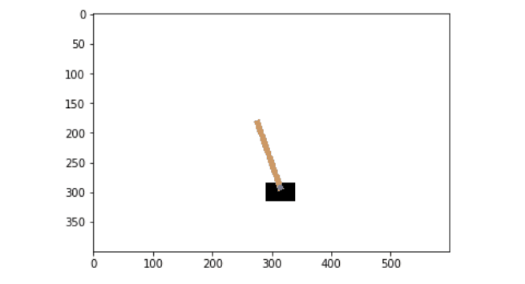
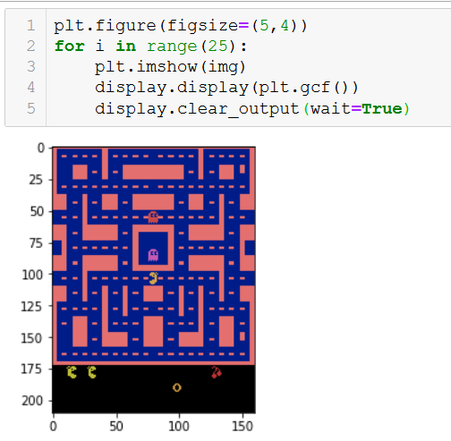

## Reinforcement leanring

A software agent makes observations and takes actions within an environment  andin return it recieves rewards. The objective is to learn to in a way that will maximize its expected long term rewards.

applications:

    1. robot
    2. pacman
    3. go
    4. controlling a thermostat
    5. stock markets

## policy search 
The algorithm used by the netowrk to determine its actions is called its policy

A policy involving randomness is called stochastic policy.

Finding a suitable policy is called policy search. Another way to explore the policy space is to use genetic algorithm, we randomly create a first generation of 100 policies and then kill 80 then let the 20 survivor produce 4 offspring each. 

Another approach is through using optimization techniques by evaluating the gradients of the rewards with regards to policy parameters, then tweakingthese parameters by following the gradien towards higher rewards(gradient ascent). This approach is also called policy gradients (PG) 

## Open ai gym

Toolkitwith 2D and 3D simulations.

Working way to represent pacman on jupyter:

### hard coded cartpole policy

### using nn
