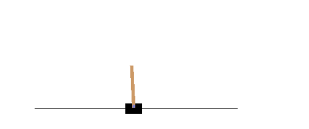
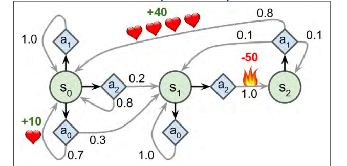
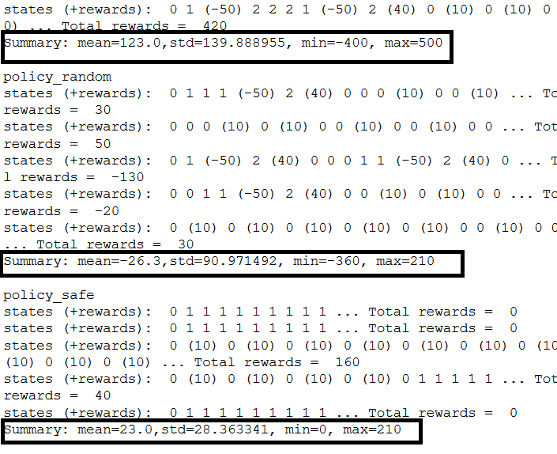
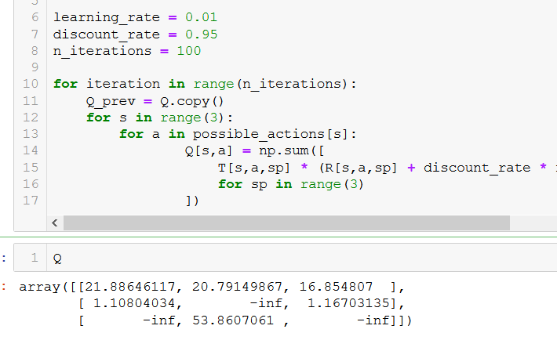
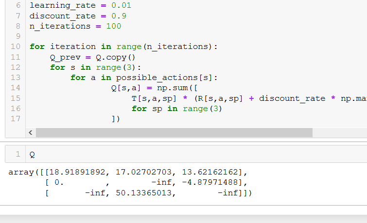
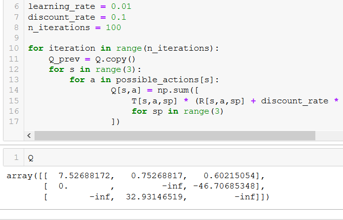
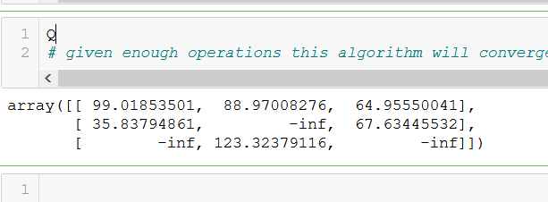

## Reinforcement leanring

A software agent makes observations and takes actions within an environment  andin return it recieves rewards. The objective is to learn to in a way that will maximize its expected long term rewards.

applications:

    1. robot
    2. pacman
    3. go
    4. controlling a thermostat
    5. stock markets

## policy search 
The algorithm used by the netowrk to determine its actions is called its policy

A policy involving randomness is called stochastic policy.

Finding a suitable policy is called policy search. Another way to explore the policy space is to use genetic algorithm, we randomly create a first generation of 100 policies and then kill 80 then let the 20 survivor produce 4 offspring each. 

Another approach is through using optimization techniques by evaluating the gradients of the rewards with regards to policy parameters, then tweakingthese parameters by following the gradien towards higher rewards(gradient ascent). This approach is also called policy gradients (PG) 

## Open ai gym

Toolkitwith 2D and 3D simulations.

Working way to represent pacman on jupyter:

### hard coded cartpole policy

env.action_space -> gives you the number of possible actions
env.step returns 4 values
obs - gives you four values , angle, angular velocity, velocity and position
reward - in environment , you get a reward of 1.0 at every step, mor matter what
done - returned when episode is over

This never managed to keep the pole upright.

# using Neural Network

Neural netowrk polcy, observaation as input and then output will be the action to be executed. Estimate a probability of each action and then we select an action randomly based on the probability

in thsi particular env, the apst actions and observation can be safely ignored
since each observation contains the environment full state. If there were some hidden state
then you may need to consider past actions and observations in order to try ot
infer the hidden state of the environemtn for example if environment only reveealed the position and not the velocit
we would have to consider past and presnt.

another exampleis if observations are noisy

we are picking one random action 
You may wonder why we are picking a random action 
based on the probability given by the policy network,
rather than just picking the action with the highest probability. 
This approach lets the agent find the right balance between exploring new actions and exploiting the actions 
that are known to work well. 
Here's an analogy: suppose you go to a restaurant for the first time, 
and all the dishes look equally appealing so you randomly pick one. If it turns out to be good, you can increase the probability to order it next time, but you shouldn't increase that probability to 100%, or else you will never try out the other dishes, some of which may be even better than the one you tried.

Training the neural network on simple heuristic of angle(0) < then left otherwise right

### Credit Assignment problem

In order to know what an action does is to evaluate anaction based on the sum of all the rewards that come after it, usually applying a discount rate r at each step
If discount rate is close to 0 then future rewrds wont count for much , rewards far into the fututre will count almost as much as the immediate rewards. In cartpole the discount rate of .95 is chosen

To get fairly normalized score we must play the game multiple times.

### Policy gradients

Policy gradients algorithms are used to optimize the parameters of a policy by following the gradients toward higher rewards. One popular class of PG algorithm called REINFORCE algorithms was introduced in 1992 by Ronald Williams.

This is how most work:
1. We let the neural network policy play the game several times, and at each step compute the gradients that would make the chosen action even more likely, and we dont applythe gradients yet

2. Once we have run several episodes, we compute each actions score 

3. If an action score is positive,it means that the action was good and you want to apply the gradients computed earlier to make the action wvwn more likely , if the score wa negative then we want to create the opposite gradients

4. Finally compute the means of all resulting gradient vectores and use it fo rgradient descent state

Despite its relative simplicity the policy gradient algorithm is very powerful it
was a similar algorithm that helped it to tackle AlphaGo

There is another family of algorithm, whereas pg algorithm directly try to optimize the policy to increase the rewards there are other algorithms that are now less direct: agent learn to estimate the _expected_ sum of discounted feature rewards
And then decides how to act.

# Markov  Processes

Studied by mathematician Andrey Markov , teh stochastic processes wiht no memory called markov chains. Such a process has fixed number of states, it randomly evolves from one state to another at each stp, the probability fot it to evolve from one state s to state s' is fixed and depends only on pair(s, s') and not on past processes. 

The starting state is the initial state and final is the terminal state. Used in thermodynamics , chemistry , statistics etc.

## Markov "decision" Processes

Markov decision process was first described by Bellman. They resemble markov chains however with a twist: at each step, an agent can choose one of several possible actions and the transition probabilities depend on the chosen action, moreover some state transitions return some reward and the agent goal is to find a policy that will maximize rewards over time. 

Bellman proposed a way to estimate the optimalstate value of any state s, noted V*(s) which is the sum of all discounted future rewards the agent can expect on average after it reaches a state s, assuming it acts optimally. 

If the system acts optimally then BEllman Optimality Equation applies. This recursive equation says that if the agent acts optimally , then the optimal value of the current state is equal to the reward it will get on average after taking one optimal action, plus the expected optimal value of all possible next states that this action can lead to

`V*(s) = max (sigma(T(s,a,s')R(s,a,s') + gamma.V*(s'))

T(s,a,s') is the transition probability from state s to state s', giventhat the agent chose action a

R(s,a,s') is the reward that the agent gets when it goes from state s to state s'

gamma is the discount rate`

This can estiamte the oprimal state value of every possible state. We frist inititalisze all the value estimates to zero then we iteratively update them using the value Iteration algorithm
These will ultimately converge to the optimal state values.

This is an exampleof dynamic programming in which we break downa complex problem into tractablesubproblems that can be tackled iteratively

for example for this state

It turns out that it is actually good to go by trial by fire

### Q values

Knowing the optimal state values can be useful in particular to evauluate a policy but it does not tell the agent what to do directly. So Bellman being bellman could not help but find  a similar algorithm to estimate the optimal state-action pair(s,a) noted Q*(s,a) is the sum of discounted future rewards the agent can expect on average agter it reaches the state s and chooses action a, but before it sees the outcome of this action, assuming it acts optimally after that action.

Once again we start by initializing all the Q value estimates to zero then we update them using Q value iteration algorithm

`Q(k + 1) (s,a) <- sigma(T(s,a,s')(R(s,a,s') +gamma(max(Q(k)(s',a'))) for all (s,a)`

Once we have optimal Q values we define the optimal policy `Pi(s) = argmax(Q*(s,a))`

For trial by fire example, the choice of discount rate affects the policy

for discount rate of 0.95

for discount rate of 0.9

for dicount rate of 0.1

### Temporal difference learing and Q learning

Temporal difference learning problems with discrete actions can often be modeled as markov decision processes but the agen initaliiy has no idea what the transition probabilities are and does not knwo rewards either. It must experience each transition at least once to know the rewards 

IN temporal differenece learning algoithm, it is similar to value iteration algorithm but it is tweaked to take into account the fact that the agent has only partial knowledge about MDP, The agent uses an exploration policy and as it progresses it updates the estimates of the state values

`V(k+1) <- (1-alpha) * V(k)(s) + alpha(r + gamma* V (k) (s')`
where alpha is the learning rate

For each state s this algorithm simply eeps track of a running averae of immediate rewards the agent gets upon leaving that sttae, plus the rewards it expects to get later 

similarly q learning algorithm is an adaptation of Q value iteration algorithm
where rewards aand transition probabilities are not known

`Q(k+1)(s,a) <- (1-alpha)Q(k)(s,a) + alpha(r + gamma * max (Q(k) *(s'a'))`
where state action pair is (s,a) and this algorithm keeps track of a running avergae og the rewards e the agent gets aupon leaving the state s with action a , plus the rewards it expects to get later

## Exploration Policies

Q learning can work only if the exploration policy explores the MDP throughly enough, Although a purely random policy is guaranteed to eventually visit every state and every transition many times, it may take extremely long time to do so, therefore we use the phi-greedy policy at each step it acts with probability pphi or greedily with probability 1- phi. The advantage of the phi-greedy policy is that it will spend more and more time eploring the interesting parts of the environemnt as the Q value estimates get betterand better, while still spendig some time visiting unknown regions of the MDP, it quite common to start with value as 1 and then gradually reducing it to 0.05

Alternatively instead of relying on chance for exploration, we can try action that are not tried much before, this is added as a bonus to the q value estimates

`Q(s,a) <- (1- alpha) Q (s,a) + alpha(r + gamma * max(f(Q(s'a'), N(s',a')))`

N(s',a')  counts the numer of time the action a' was chosen in state s'
f(q,n) is an exploration function such as f(q,n) = q + K/(1+n) where K is a curiosity hyperparameter that measure how much the agent is attracted to the unknown

## Approximate Q-Learning

The main problem is that Q learning doesnot scale weell to large or even medium MDPs with many states and actions, as in the case with pacman, the solution is to use a managemble number of paramters also known as approximate Q learning, for years it was recommended to use linear combinations of hand crafted features extracted from stsae, but now we know that we ca use Deep Q networks to solve the problem

# Using DQN toplay Ms. Pac-Man

