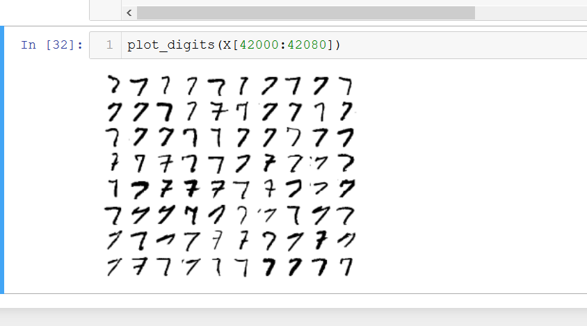
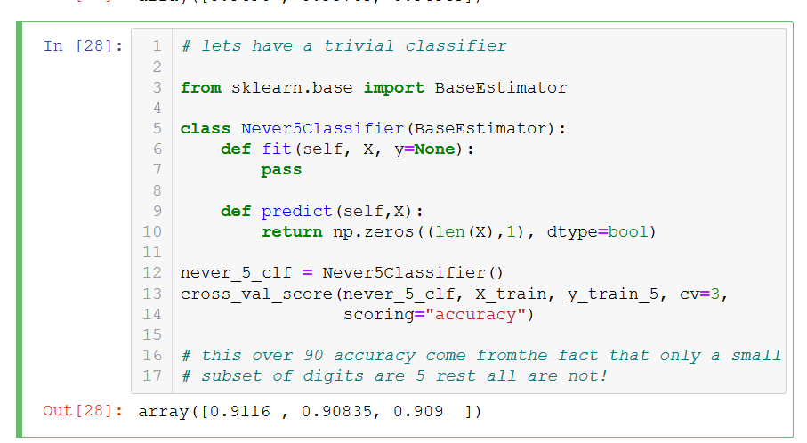
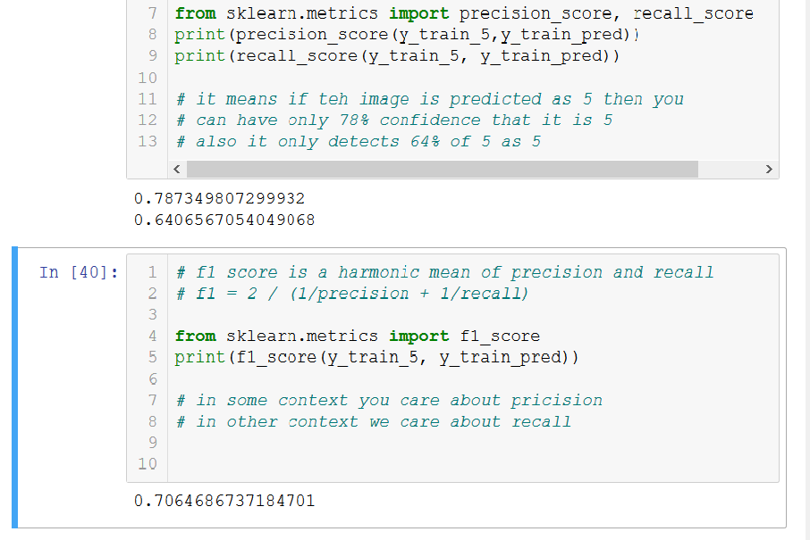
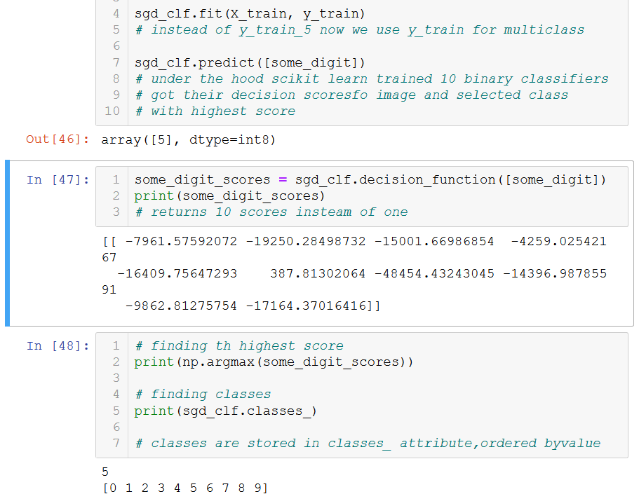
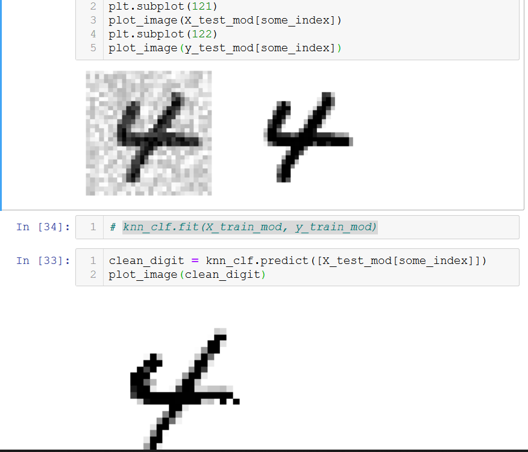
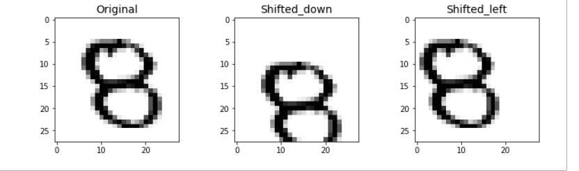
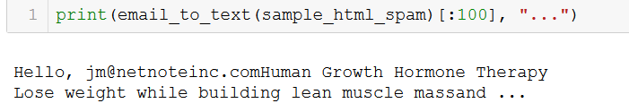
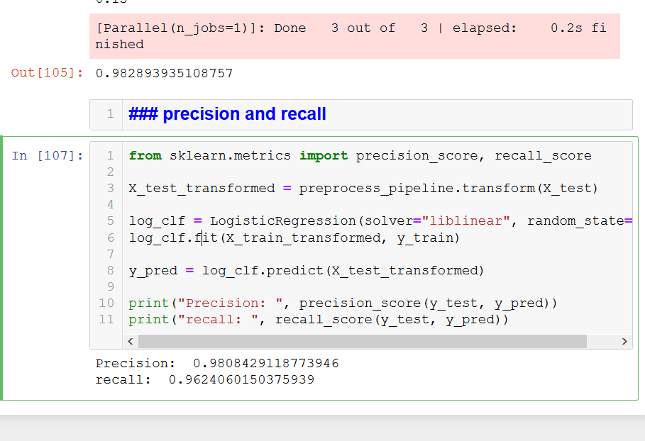

# MNIST CLASSIFICATION

## Some lessons learnt
1. always put the line which requires most computation in a new cell

## mnist data
Every scikit learn dataset has a
DESCR key
Data key and 
Target key

## Binary classification

Evaluating for five and not five

1.using Stochastic gradient descent
2. Performance measures - cross validation
    custom cross validation and cross_val_score()
    We dont take in accuracy as the valid measure of performance
    because in skewed databases accuracy can be misleadingas is how by 
    a trivial never 5 classifier
    

3. Confusion matrix
    We count the number of instances of classA wrongly classified as B
    To compute this we need to have a set of predictions, we dont use test set
    but use cross_val_predict()

4.F1 score care about the harmonic mean between precision and recall 
    if you want a child lock then you would want to have low recall
    if you want to use it for video classification then you want 99 recall
    
    There is a tradeoff between precision and recall. Which means what you want most confidence in predictions or predicting more values

5. ROC curve
Reciever operating characteristics , similar to precision and recall curve but instead it plots true positive rate (recall) with false positive rate

## Multiclass classification

SOme algorithms like Naive Bayes and Random forest classifiers are capable of handling multipe classes directly

Others like SVM and Linear classifiers are strictly binary classifiers. Yet it canbe done.
for ex by training 10 binary classifiers for mnist and then poll results also known as one-versus-all

other is to train classifier for all pair of digits, 1 and 0 , 0 and 2, 1 and 2 =n *n-1/2, for n= 10 it means 45 classifiers. also known as one -versus-one.

Scikit learn automatically detects when you try to use abinary classification algorithm for multiclass and automatically run one-versus-all except for svmwhere it run one-versus-one

## Error Analysis

1. Make confusion matrix more comprehensible
2. Analysing individual errors

## Multilabel classification
using KNN
We are removing noise, works almost like regression

## Titanic Submission

1. In my first attempt I used Random forest classifier with the score of 77.511

2. Using RFC I scored even less I wonder why
76.011

## KNN and shift augmentation

## Spam classifier

Parse email:

Final precision and recall:

    
    
    