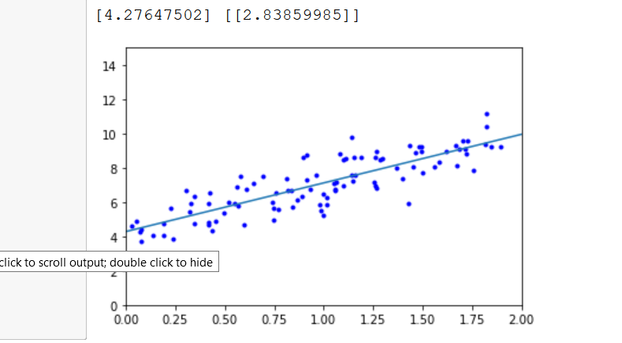
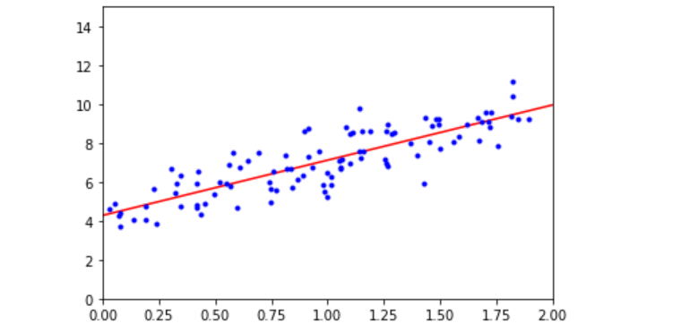
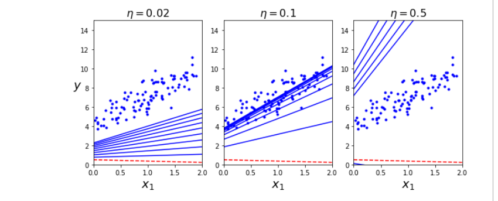
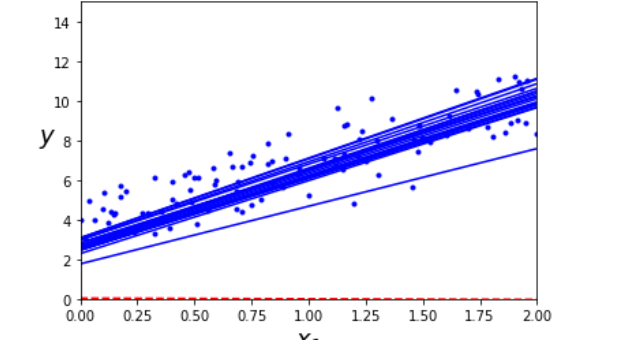
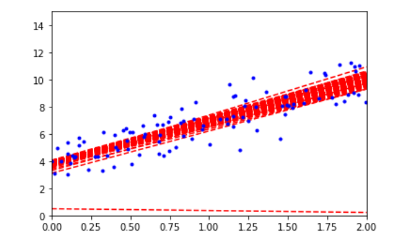
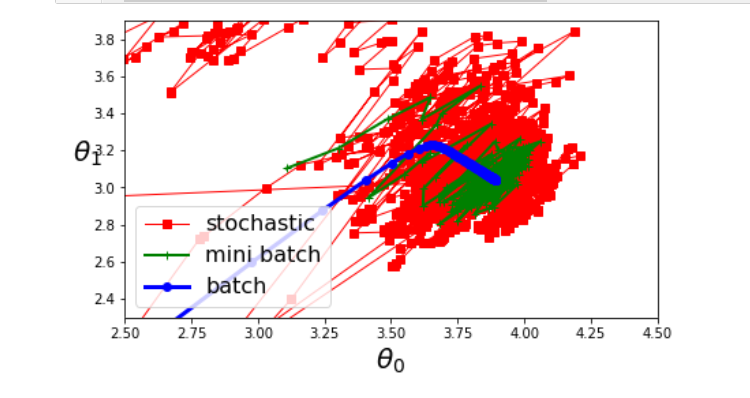

Training a model

    Training a model loosley translates to setting its parameters so that the model best fits the training set. For this we need to see what is the effect of different parameters on training data
    
    The most common performance measure is RMSE. Therefore,
    Training a linear model means we need to find the value of theta that minimises RMSE
    In practice it is simpler to minimise the Mean Square Error (MSE) than RMSE. Which also gives us the same result.
    
Linear regression
    
    finding parameters using normal equationfor mean square error
    
   
    
    Using scikitlearn default,
    
   
    
Computational complexity

    The normal equation gets very slow when the number of features grows large (e.g. 100,000).
    Computation complexity of inverting a X.T.dot(X) is O(n^3)
    However noraml euqtion is linear with regards to the number of instances in the training set so that it can handle large training sets efficiently.
    And once the model is trained the predictions are very fast
    the computational requirement is linear

Different ways to train a linear model

    Gradient Descent : Tweaks parameters iteratively to minimize the cost function
    It measures the local gradient of errorfunction with regards parameter vector theta, and goes in the direction of descending descent. Once the gradient is zero, you have reached the minimum.
    
    In essesnce you'll fill theta with random values and then improve it gradually throughout the training.
    The size of steps is learning rate, youll have to go though many iterations to converge.
    
    if its too small then it takes a long time
    if its too big then it makes algo diverge
    
    it can also reach local minimum instead of global minimum
    
    The cost function of MSE happens to be a convex function, which means that if you pick any two points on the curve the line swgment joining them will never cross the curve it means 
    theres is no local minima only a global minimum
    its a continuos function that never changes abruptly
    
    We need to ensure that all features have similar scale(range) using StandardScalar
    
    Training a model in this context means a search in models parameter space, more parameter more dimesnions means more time to search.
    
Batch Gradient Descent

    To implement gradient descent we need to compute teh gradient of cost function with regards to each model parameter theta. i.e. we need to calculate how much the cost function will change if we change theta a little. This is called partial derivative.
   
   
    Convergence rate is given by O(1/iterations) devide the tolerance by 10 then algorithm will have to run about 10 times more iterations.
    
Stochastic Gradient Descent

    BGD checks for gradient at every step which makes it very slow when training set is large. Stochastic Gradient Descent just picks a random instance in the training set at every step and computes the gradient based on that single instance. 
    Due to its stochastic (random) nature this is much less regular instead of gently decreasing , the cost function will go up and doen decreasing only on average. You will get a god result but not the optimal.
    Since cost function will jump around a bit therefore we have to reduce learning rate so that it settles on a global minimum
   
   
    Steps are bigger in the beginning then gradually reduces this is called simulated annealing. Learning schedule is a function the takes care of learning rate in each iteration.

Mini Batch Gradient Descent

    In mini BAtch gradient at each step instead of computing gradients based on full training set like batch GD or only one instance like SGD mini batch gradient descent computes gradients onsmal number of batches called mini batches. The main advantage is that you can get a performance boost using matrix operations over gpu.
   
    
    It may be difficult to escape local minimum however mini batch is less irrelgular than SGD

