Training a model

    Training a model loosley translates to setting its parameters so that the model best fits the training set. For this we need to see what is the effect of different parameters on training data
    
    The most common performance measure is RMSE. Therefore,
    Training a linear model means we need to find the value of theta that minimises RMSE
    In practice it is simpler to minimise the Mean Square Error (MSE) than RMSE. Which also gives us the same result.
    
Linear regression
    
    finding parameters using normal equationfor mean square error
    
   
    
    Using scikitlearn default,
    
   
    
Computational complexity

    The normal equation gets very slow when the number of features grows large (e.g. 100,000).
    Computation complexity of inverting a X.T.dot(X) is O(n^3)
    However noraml euqtion is linear with regards to the number of instances in the training set so that it can handle large training sets efficiently.
    And once the model is trained the predictions are very fast
    the computational requirement is linear

Different ways to train a linear model

    Gradient Descent : Tweaks parameters iteratively to minimize the cost function
    It measures the local gradient of errorfunction with regards parameter vector theta, and goes in the direction of descending descent. Once the gradient is zero, you have reached the minimum.
    
    In essesnce you'll fill theta with random values and then improve it gradually throughout the training.
    The size of steps is learning rate, youll have to go though many iterations to converge.
    
    if its too small then it takes a long time
    if its too big then it makes algo diverge
    
    it can also reach local minimum instead of global minimum
    
    The cost function of MSE happens to be a convex function, which means that if you pick any two points on the curve the line swgment joining them will never cross the curve it means 
    theres is no local minima only a global minimum
    its a continuos function that never changes abruptly
    
    We need to ensure that all features have similar scale(range) using StandardScalar
    
    Training a model in this context means a search in models parameter space, more parameter more dimesnions means more time to search.
    
Batch Gradient Descent

    To implement gradient descent we need to compute teh gradient of cost function with regards to each model parameter theta. i.e. we need to calculate how much the cost function will change if we change theta a little. This is called partial derivative.
   
   
    Convergence rate is given by O(1/iterations) devide the tolerance by 10 then algorithm will have to run about 10 times more iterations.
    
Stochastic Gradient Descent

    BGD checks for gradient at every step which makes it very slow when training set is large. Stochastic Gradient Descent just picks a random instance in the training set at every step and computes the gradient based on that single instance. 
    Due to its stochastic (random) nature this is much less regular instead of gently decreasing , the cost function will go up and doen decreasing only on average. You will get a god result but not the optimal.
    Since cost function will jump around a bit therefore we have to reduce learning rate so that it settles on a global minimum
   
   
    Steps are bigger in the beginning then gradually reduces this is called simulated annealing. Learning schedule is a function the takes care of learning rate in each iteration.

Mini Batch Gradient Descent

    In mini BAtch gradient at each step instead of computing gradients based on full training set like batch GD or only one instance like SGD mini batch gradient descent computes gradients onsmal number of batches called mini batches. The main advantage is that you can get a performance boost using matrix operations over gpu.
   
    
    It may be difficult to escape local minimum however mini batch is less irrelgular than SGD

Polynomial Regression

    We can fit a linear model in non linear data. Add powers of each feature as new features and then train linear model on this extended set of features.
   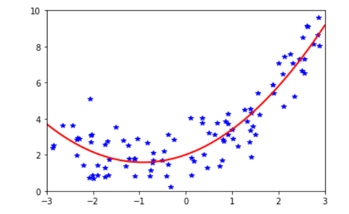
    
    Polynomialafeatures transforms an array of n features into an array of (n+d)!/ d!n! features where n! us the factorial of n.
    
    For ex 100 degree polynomial
   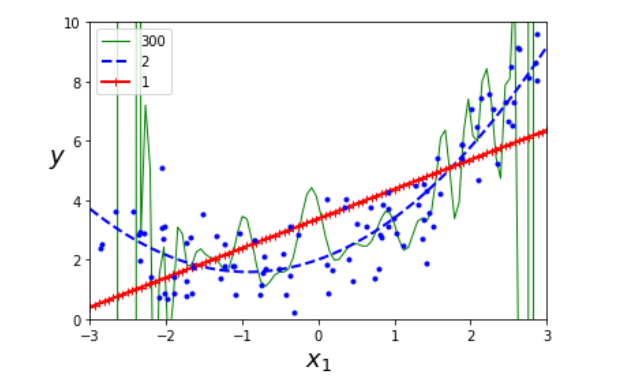
    
Learning Curves

    If model performs poorly on test data but best on training data then it is severly overfitting. In order to know if  a model is learning correctly or not we can use earning cureves on training set and validation set.
    
   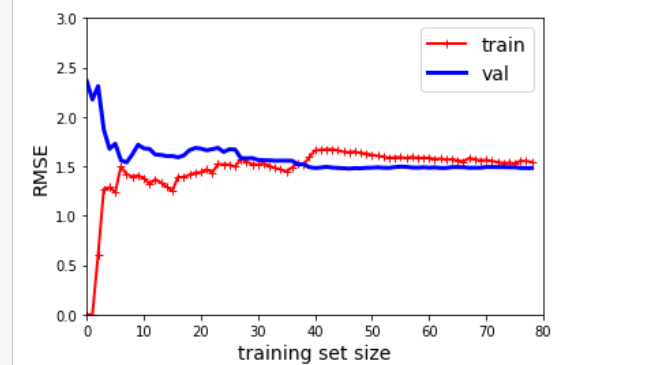
   
    Learning curve of degree 10
   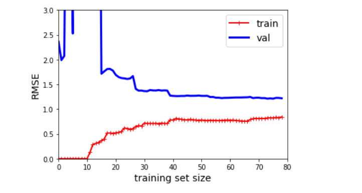
   
    If your model is underfitting adding more training examples will not help

    The key points to note in 10 degree curve
    The errorontraining data ismuch lower
    There is a signifiant gap which means it is overfitting, however more data would help you close the gap
    
Bias variance tradeoff

    Models generalisaiton error can be expressed as sum of three very different errors:
    Bias : 
        choosing lower degreee polynomial
        This is due to wrong asumptions, this will cause underfitting
    
    Variance : 
        This is because of excessive senstivity to small variations in the training data. High degree polynomial will have more variance
    
    Irreducible error:
        This is due to noisiness of the data itself. The only way to reduce this part of error is to clean up the data
        
    Increasing modelcomplexity will decrease bias and increase variance
    
Regularising Linear models

    One way to avoid overfitting is to restrict the degree of freedom it has that is reduce the degree. This is achieved by contraining the weights of the model
    
    The term added ensures that the parameters are minimum as possible. so there would be less variance. hence solves overfitting.
    
    Ridge regression: regularised version of linear regression a term alpha * sum over n(theta square) is added to the cost function This forces the the learning algorithm to not only fit the data but also keep the modelweights as possible. This term is added to cost function only during training, The evaluation should be done with unregularised parameters.
    
   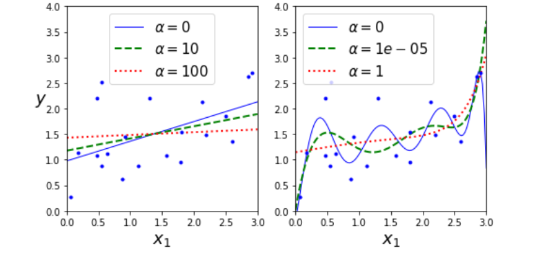
    
    if alpha =0 then ridge regression is jst linear regression, ifalpha is very hig then result will be a flat line.
    J(theta) =MSE(theta) + alpha * 1/2 * sum(theta^2)
    
    Lasso : Least absolute shrinkage ans selection operation regression uses l1 form, lasso regression tends to replace the least importnatn features.
   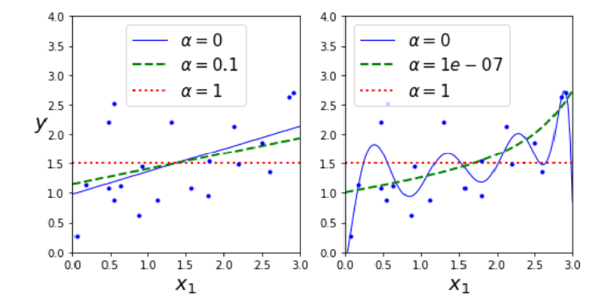
    
    Elastic net: the mddle ground betwen ridge and lasso regression. It mixes both ridge and lasso regularisation in a ratio r. when few features are required we should use lasso or elastic net otherwiese ridge is a good default
    
    Early stopping: one way to regularise the iterative learning lagorithm such as gradient descent is to stop training as soon as the validation error reaches a minimum. This is called early stopping. trick is to find that minimum.
   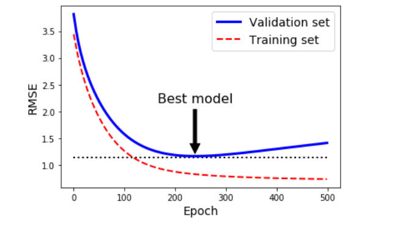
   
    comparison between various regularisation models:
   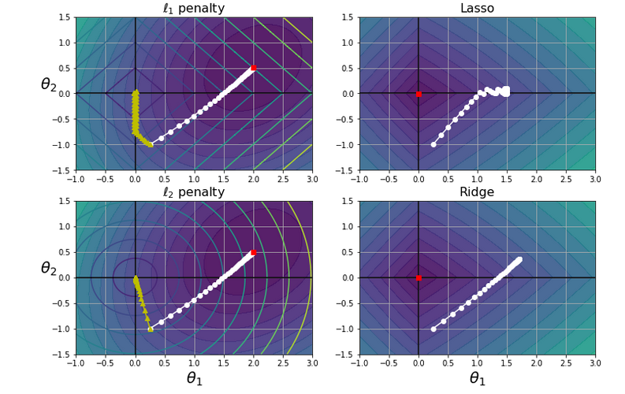

Logistic Regression

    Logistic regression is used for classification, it gives probability for a class, a binary classifier. it computes a wighted sum of input features plus a bias term.
    
    Logistic function uses something like the sigmoid function
   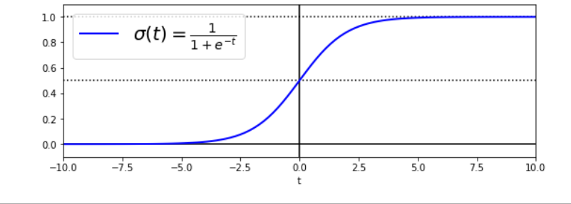
   
    During training it uses a cost function based on log function
    No normal equation exist however we can calcualte using partial derivatives it gives a sureshot global minimum.
   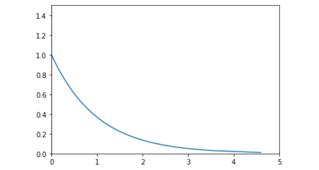
   
Decision boundaries
    
    Used on iris dataset for multinomial and single calssification
    Iris virginica vs non iris-virginica
   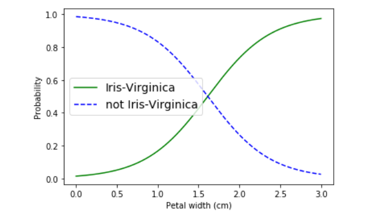
   
    Two feature iris
   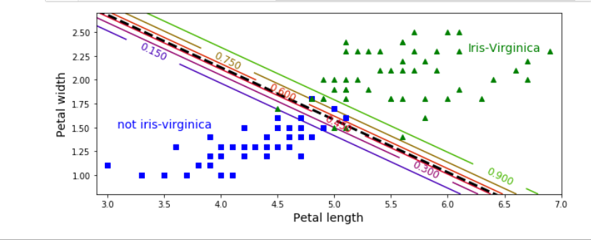
    
Softmax
    
    Logistic regression can be generalised to support multiple classes directly this is called softmax or multinomial logistic regression.
    
    can only be used with discrete classes for example cannot recognise individuals ina group picture
    
    THe solver used for softmax regression is lbfgs, it also applies l2 regularisation by default, which is controlled by hyperparameter C
    
    given x softmax regression model computes the probability of each class by applying softmax function (also called normalised exponential)
    Three features (multinomial)
   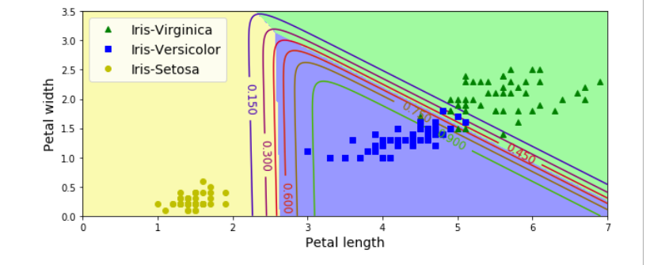
  
Cross entropy

    Crossentropy originated from information theory. Suppose you want to efficiently transmit information about weather everyday. and there are 8 options you could encode each option using 3 bits since 2^3 = 8
    however it is more efficient to code sunny on fits bit then sending other in 4 bits seperately if it ussually sunny. cross entropy measure the amount of bits you actually send per option. if assumption is wrong then our cross entropy will be greateer than anamount called Kullback-Leibler divergence
    
    the cross entropy betwenn two distributions p and q is defined as H(p,q) = - sum(p(x)log(q(x))) when distributions are discrete
    

Exercises : 

    1.Linear Regression algorithm for training millions of features, stochastic gradient descent, or batch gradient descent if the features fit in memory but cannot use the normal equation then the computational requirement is too high.
    
    2. If features have very different scales then gradient descent will be an elongated bowl. Normal equation will work fine without scaling.
    
    3. Gradient descent never gets stuck on a local minimum because function is convex.
    
    4. No stochastic gradient descent doesn't provide an optimal solution. unless we reduce the learning rate
    
    5. If training error goes along with the validation error then learning rate becomes too high and algorithm starts to diverge. If training error does not go up and only validation it means that the model is overfitting. Early stopping can be used. we need to stop training.
    
    6. in batch and mini batch gradient models the error rises up progressively so we need to wait a bit before we stop training. The best way is to save model progressively and when validation error is consistently goingup use alast saved model.
    
    7. Stochastic gradient descent will reach its destination the fastest. However the actual convergence would be done by only batch gradient, the other gradient algos will never reach the optimal value unless you reduce the training rate.
    
    8. If there is a large gap between validation error and training error in polynomial regression, then it means model is overfitting. ways to counter it:
        1. regularisation through ridge or lasso
        2. early stopping
        3. Reduce the number of degree of polynomial
        4. increasing size of training set
    
    9. High bias means that the model is too simple. High variance means model is too complex. If training error and validation error are both high it means that there is high bias. we need to choose a better model. that is underfitting you can also reduce the alpha of regularisation.
    
    10. Ridge regression avoids overfitting through regular regression.Ridge regression is always invertible.
        Lasso uses l1 regression so it eliminates the importances of least required features, leads to sparse features.
        Elasticnet is the middle ground. Because lasso sometimes leaves the correlated features.
        
     11. For classification between inddor/outdoor and daytime/nightime, since they are not mutually exclusive we use logistic regression

Batch gradient descent for softmax without scikit learn

   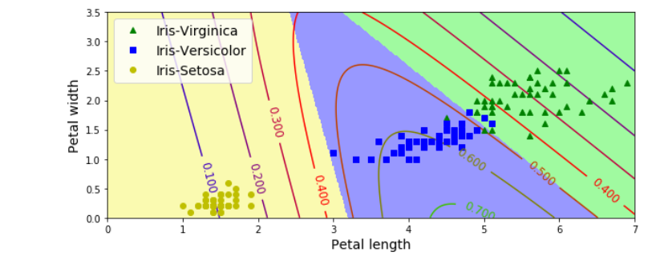
    
    
    