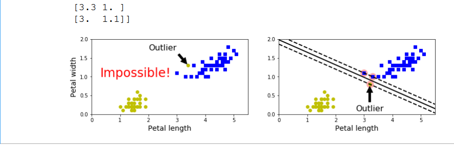
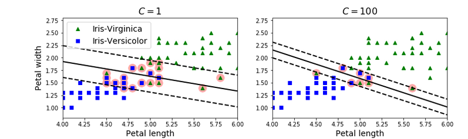
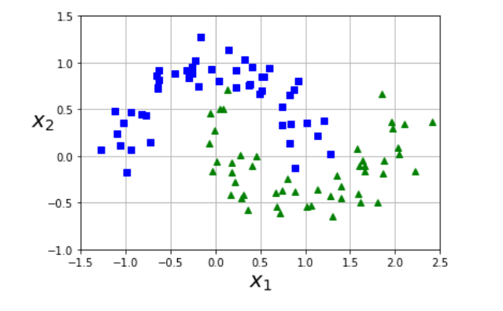
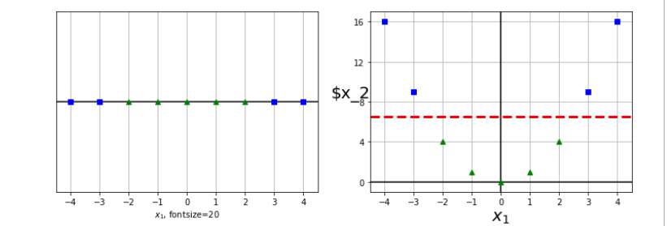
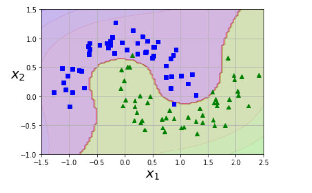
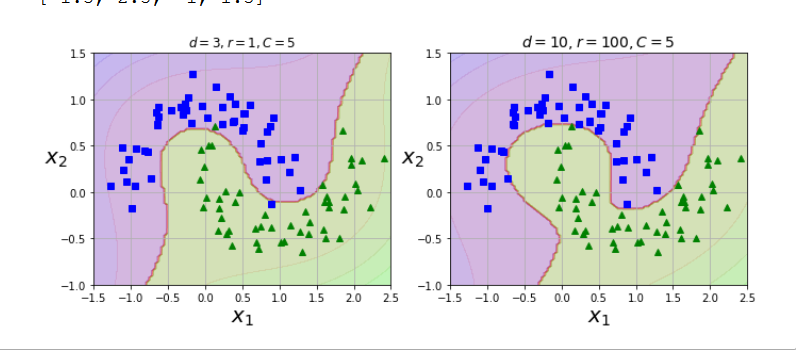
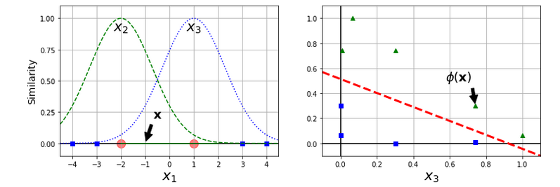

# Support Vector Machines

## Linear SVM Classification

Two classes can be seperated linearly, they are linearly seperable. SVM comes up with a line that seperates the two classes and stays away from the closest training instances. Also caleed large margin classification.

They are dependent on training instances that are on the edge and don
t generally get effected by adding more training instances.

They are sensitive to feature scale.

They are also sensitive to outliers.

Support vectors are the vectors that are used to build the hyperplane or decision boundary.

Hard margin classification : all instances should be at either side of the line. Issues : only works if data is linearly seperable, and it is quite sensitive to outliers. To avoid er use soft margin classificaiton.

Soft margin classification : It allows for margin violations and gives an approximately good model deviding the datasets. 
Using higher C value leads to less violation but less wider margins as well.
using lower C value leads to more violation but wider margin. This will generalise better. Best way to regularise it by reducing c.

Large margin vs small margin.

## Non Linear SVM Classification

Since most ofthe time data is not linearly seperable. We need to use non linear SVM classification. One approach is to add more features,which results in a linearly seperable data set, dsuch as polynomial features 

It mens now we will use SVC with higher degree terms. 

By a simple kernel trick, without explicity defining feature map. For degree 10.

The SVC can also be developed using similarity features computed by a similarity fucntion. One ofthe similarity function is Gaussian RBF.
It transforms m instances and n features to m instances and m features

A kernal trick

For many algorithms the data in raw representation have to be explicitly transformed into feature vector representations via a user-specified feature map: in contrast, kernel methods require only a user-specified kernel, i.e., a similarity function over pairs of data points in raw representation.

gamma is the regularisation feature, if model is overfitting we have to reduce it otherwise will have to increase it.

