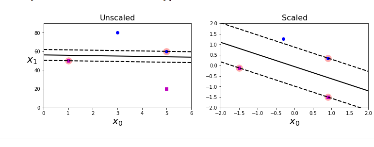

# Support Vector Machines

## Linear SVM Classification

Two classes can be seperated linearly, they are linearly seperable. SVM comes up with a line that seperates the two classes and stays away from the closest training instances. Also caleed large margin classification.

They are dependent on training instances that are on the edge and don
t generally get effected by adding more training instances.

They are sensitive to feature scale.

They are also sensitive to outliers.

Support vectors are the vectors that are used to build the hyperplane or decision boundary.

Hard margin classification : all instances should be at either side of the line. Issues : only works if data is linearly seperable, and it is quite sensitive to outliers. To avoid er use soft margin classificaiton.

Soft margin classification : It allows for margin violations and gives an approximately good model deviding the datasets. 
Using higher C value leads to less violation but less wider margins as well.
using lower C value leads to more violation but wider margin. This will generalise better. Best way to regularise it by reducing c.

Large margin vs small margin.

## Non Linear SVM Classification

Random moons dataset:

Since most ofthe time data is not linearly seperable. We need to use non linear SVM classification. One approach is to add more features,which results in a linearly seperable data set, dsuch as polynomial features 

It mens now we will use SVC with higher degree terms. 

By a simple kernel trick, without explicity defining feature map. For degree 10.
A kernal trick

For many algorithms the data in raw representation have to be explicitly transformed into feature vector representations via a user-specified feature map: in contrast, kernel methods require only a user-specified kernel, i.e., a similarity function over pairs of data points in raw representation.

The SVC can also be developed using similarity features computed by a similarity fucntion. One ofthe similarity function is Gaussian RBF.
It transforms m instances and n features to m instances and m features

gamma is the regularisation feature, if model is overfitting we have to reduce it otherwise will have to increase it.

Effect of hyperparameter on rbf

some kernels are chosen based on dataset, string kernel is chosen for stringsof DNA sequence. String subsequence kernel. Always go with linear kernel first.

LinearSVC class is based on liblinear library which implements an optimised algorithm, the dual coordinate descent methds for large scale linear SVM. It doesnot support kernel trick but it scales almost linearly with numbe rof training instances and features O(m x n).

The algorithm takes longer if you require a very high precision. this is controlled by tolerance parameter epsilon.

SVCclass is based on libsvm library which supports the kernal trick. The training complexit is between O(m^2 x n) and O(m^3 x n). That means it gets dreadfully slow when number of features are more. This is perfect for complex but small data sets. Is good for sparse features.

## SVM Regression

Insteadof trying to fit the largest possible street between two clases while limiting margin violations, SVM regression tries to fit in as many instances as possile on the stree while limiting margin viollations. The width is controlled by a hyperparameter epsilon.

Adding more training instances within the margin does not affect the model's predictions thus it is epsilon insensitive

To takle nonlinear regression tasks we can use kernelized svm model.

## Under the hood

We usually denote all model parameters by theta adn add a bias input x1 = 1 to all instances. However right now we will denote weights by w and bias by b.

IT is a two dimensional plabe since the dataset of iris has two features (petal width and petal length) The decision is the setof points where the decision function is equal to 0: intersection of two planes a straight line the dashed lines form the boundary -1 and 1. Training a SVM mena finding value w and b such that margin is as high as possible without violatin of the margin violations.

Slope of decision function is the norm of weight vector ||w|| devide the slope by 2 then the points where decision function is equal to +-1 are going to be twice as far away from the decision boundary. In other words deviding the slope by 2 will multiply the margin by 2. smaller the weight vector w , larger the margin.

if there are n features then the decision function is an n dimensional hyperplane and thedecision boundary is an n-1 dimensional hyperplane.

So we need to minimise the ||w||, but we also want to have hard margin that is avoid any violations we need the decision funciton tobe more than 1 for all training instances and lower than -1 for negative training instances.

