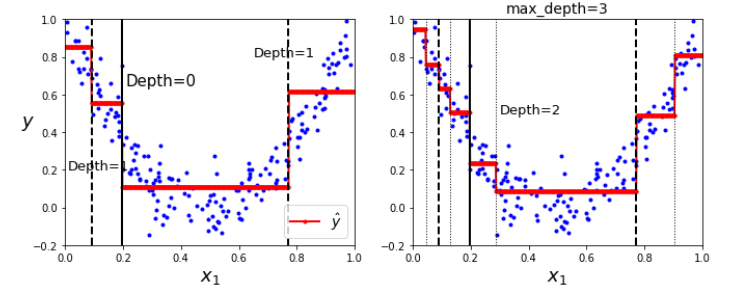
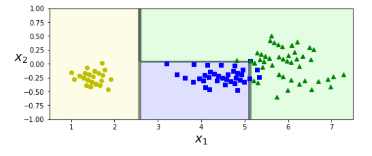
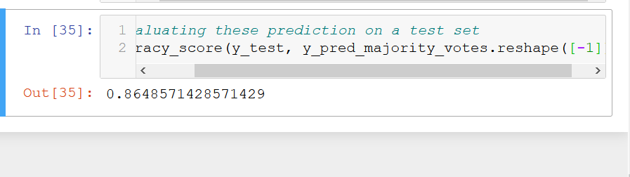

Training and visualising

    This can be done by export_graphviz function.

Making predictions

    You start at the root node then considering the conditions at each node we move down the tree.
    
    They require very little data preparation.
    
    Attribute description:
        samples :  indicate howmany training instances it applies to.
        value : tells you how many training instances of each class it applies to
        gini: This tells you teh level of impurity, That is gini would be 0 if all training instances belonged to the same class
    
    Decision Tree boundary
   
      
      thick vertical lines represtnt the decision boundary of the root node depth 0 since left area is pure it cannot be split any further , however the right area is impure so depth -1 right node split at petal width 1.75 cm. right now the depth is 2, however if the max depth was three then again it would have split denoted but dotted lines.
   
White box model vs black model

    This model is easy to intrepret that is why it is known as white box model
    Random forest and neural network are called black box models as they are not easy to fathom
    
Estimating class probabilities:
    
    A decision tree can also estimate if an instance belongs toa class with certain amount of probability

The CART training algorithm
    
    Scikit uses the Classification and Regression tree (CART) algorithm to train decision trees this idea is that algorithm first splits the training sets into two subsets using a single feature k and a threshold tk. how does it choose k and tk ?  it searches for a pair of k, tk in order to create the purest subset. 
    
    It only produces binary trees.
    
    max_depth , min_samples_splitm min_samples_leaf, min_weight_fraction_leaf and max_leaf_nodes all affct CART.
    
    CART algorithm is a greedy algorithm: It greedily searches for an optimum split at top level, then repears the process at each level.
    
    finding the optimal tree is known as an NP compltet problem
    It requires O(exp(m)) time.
    
    P is a set of problem that can be completed in polynomial time.
    NP is a set of problem that can be verified in polynomial time.
    NP-complete problem is both NP and NP-hard.
    we donot know if P = NP

Computational complexity

    traversing decision tree takes roughly O(log2(m)) nodes. 
    since each node only requires checking the value of one feature, the overallpreiction complexity is O(log2(m)) independent of the features.
    
    However training complexity is more because O(n x m log(m)) as the algorithm compares all features at each step.
    
Gini impurity or entropy

    the gini impurity measure is used by default but you can select entropy measure also, by setting criterion hyperparameter. 
    
    Entropy comes from information theiry and is 0 when all messages are identical. reduction in entropy is called information gain. entropy favors balanced tree but most of the time its inconsequential.
    
Regularisation Hyperparameter

    Decision tree makes very few assumption so there is more chance of overfitting in decision trees. 
    
    it is called non parameteric model as the number of parameters are not defined befoer trianing.
    
    in a prametric model like linear model the degree of freedom is limited (however higher chance of underfitting)
    
    Decision tree overfitting is prevented by reglarisaiotn parameters:
    
    max_depth 
    min_samples_split - min number of samples a node must have before it can be split
    min_samples_leaf - min number of samples for a leaf node
    min_weight_fraction_leaf - fraction of weighted instances that will be used in leaf nodes
    max_leaf_nodes - max number of leaf nodes
    max_features - max number of features that are evaluated before splitting each node
    
    another way is to train decision tree without restricitons then pruning (deleting) unnecessary nodes a node whose childern are all leaf nodes is considered unnecessary if the purity improvement is not statistically significant
    
    Standard statistical tests like the X2 test are used to estimate probability that the imporvement is purely the result of chance (which is also called null hypothesis)
    
    If this probability is higher than a given thrshold then the node is considered unecessary.
    
Decsiison tree on moon dataset

    with default and min_samples_leaf=4 
   
   

Regression

    In regression instead of predicting a class in each node it predicts a value. You traverse the tree starting at root, and then you eventually reach leaf node that predicts the value. This prediction is simply the average target value of 110 training instances associated with the leaf node. 
    
    Cart function cost function is related to mse it tries ot reduce the mean square error.
    
    they are prone to overfititng.
    
    Regression at different depths:
   
   
    Regression is prone to overfitting:
   
    
Instability

    Decision tree have orthoganal decsion boundarys taht is all splits are perendicular to an axis. Which makes them sensitive to training set rotation. 
    
   
    
    another example:
    
   
    
    If you remove the widest Iris- versicolor from the iris dataset and train decision tree which is very different than the previous.
    
   
   
   
## Exercises

 1. Depth of a well balanced tree containining m leaves is equal to log2m^3. A binary decision tree is lesss ot balanced. this if there are 1 million instances then decision treewillhave a depth of log210^6 = 20
     
 2. gini impurity is generally lower than parents. Because of CART's cost functoin which splits each node in a way that minimises the weightedsum of its childrens gini impurities. however if one child is smaller than the other, a parent cna have more impurity as long as increase is more than compensated by decrease in other childs impurity.
 
 3. yes.to regularise the model, we can decrease max_depth.
 
 4. scaling the input features doesn't matter for decision tree.
 
 6. presorting the training dataset wll only affect the dataset if data set is smaller than a few thousand indices, ifit contaitns 100000 instances presortwill be very time consuming.
 
 7. Grid search cv best params :
 
 
 8. Growing a forest : 
 