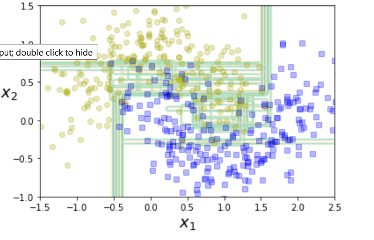
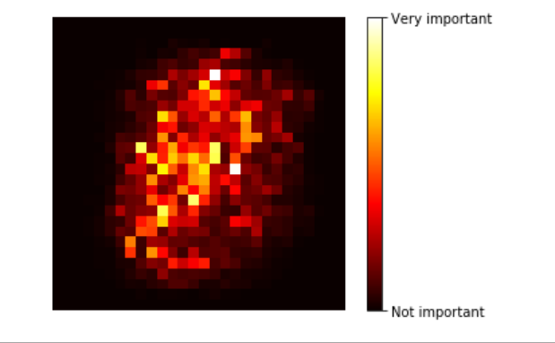
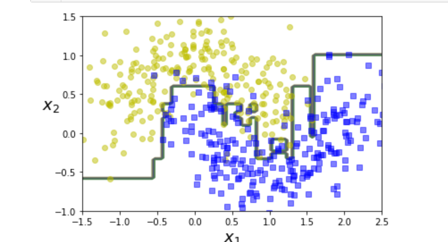
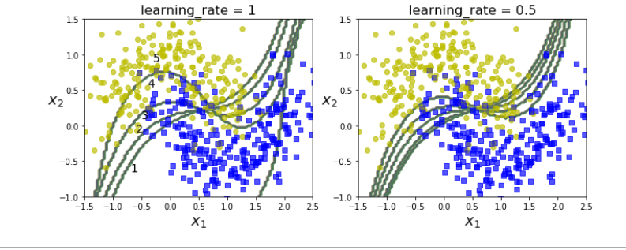

# Ensemble earning

1. Works on the principle of wisdom of the crowd.

an example where a small bias can go a long way when number of tosses are more:

2. We combine multiple classifiers. And take the classifier with the best predictions. Even if the classifiers are weak still the combined aggregate can be a strong learner.

### Bagging and pasting

1. we can train different algorithms oruse the same algorithmon differnet subsets of datatsets. WHEN SAMPLING IS PERFORMED WITH REPLACEMENT IT IS CALLED BAGGING AND WIHTOUT REPLACEMENT IT IS CALLED PASTING.

In other words both bagging and pasting allow the training instances to be sampled several times accross multiple predictor but only bagging allows the training instances to be sampled several times forthe same predictor.

We use the statistic mode for aggregating the final decision.Aggregatingreduces both bias and variance, the prediction can be done parallely.

bagging classifier automatically does soft voting if the base classifier can estimate class probabilities (if it has a predict_proba function), bagging often results in better performance than pasting.

### Out-of-bag evaluation

With bagging some instances may be sampled several times for any given predictor, while others may not be sampled at all. By default a bagging calssifier samples mtraining instances with replacement (bootstrap=True) where m is the size of the training set.It means only 67 percent of all training instances are sampled rest 33 are not sampled. The training samples that are not sampled are called outof bag oob instances.

This oob can be used for cross validation.

This can be done automatically in BaggingClassifier

### Random patches and Random subspaces

BaggingClassifier supports sampling of features as well through max_features and bootstrap_features. They work the same way as max_samples and bootstrap. but for feature sampling than instance.

This is useful when dealing with high dimensional input such as images. sampling both training instances and images is known as random patches method. keeping training instances (bootstrap=False and max_Samples=1.0) and sampling features (bootstrap=true and or max_features smaller than 1.0 is called random subspaces method.

Sampling features results in even more predictor diversity trading a bit more bias for lower variance. 

### Random forests

Random forest is an ensemble of Decision Trees, generally trained via bagging method (or sometimes pasting) and max_samples are set to the size of training set.

Instead of building a BaggingClassifier and passing it a DecisionTreeClassifier you instead use RandomForestClassifier which is optimised for decison class using available CPUcores

Random forest algorithm introduces extra randomness when growing trees instead of searching for the very bet feature when splitting a node. This results in greater tree diversity. 

### Extra trees

when you are growing a tree in Random forest at each node only a random subset of features is considered for splitting. It is possible to make trees even more random by also using random thresholds for each feature than searching for the best possible thresholds (like regular Decision Trees)

A forest of such extremely random trees is simply called an Extremely Randomized Trees ensemble. This adds more bias and less variance.

You can create an Extra-trees calssifier using Scikit learn ExtraTreesClassifier class. SImilarly ExtraTreesRegeressor class also exists.

### Feature importance

important features appear at root of tree while unimprtant features often appear closer to leaves or not at all.

### Boosting

Boosting originally called hypothesis boosting refers to an enseble meathod tha combine weak learners to make a strong learner. 

Trains predictors sequentially, each trying to correct its predecessor.

### Adaboost

IN adaboost the new predictor pays a bit more attention to the training instances that hte predecessor underfitted. 

The wrong classifications weights are boosted in a sequentia manner, so instead of minismising a cist function adaBoost adds predictors to the ensemble gradually making it better.

