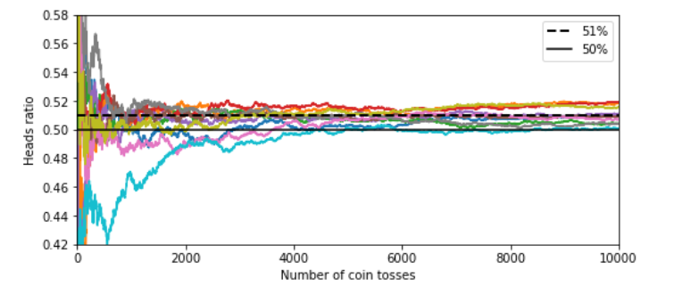
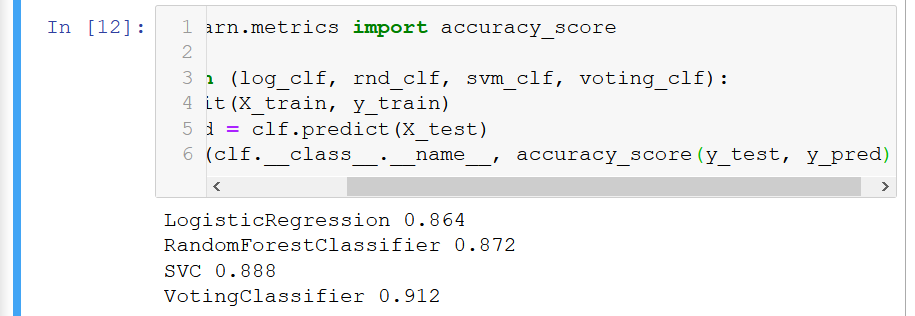
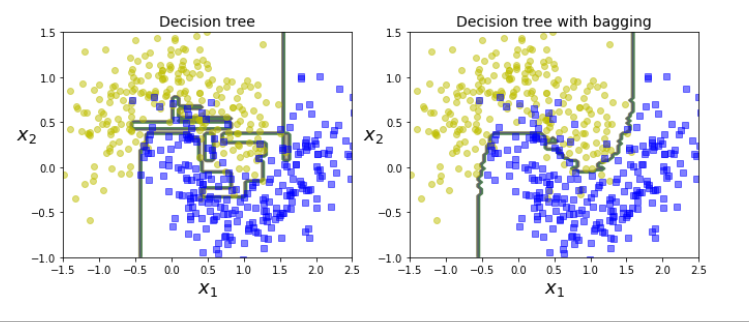

# Ensemble earning

1. Works on the principle of wisdom of the crowd.

an example where a small bias can go a long way when number of tosses are more:

2. We combine multiple classifiers. And take the classifier with the best predictions. Even if the classifiers are weak still the combined aggregate can be a strong learner.

### Bagging and pasting

1. we can train different algorithms oruse the same algorithmon differnet subsets of datatsets. WHEN SAMPLING IS PERFORMED WITH REPLACEMENT IT IS CALLED BAGGING AND WIHTOUT REPLACEMENT IT IS CALLED PASTING.

In other words both bagging and pasting allow the training instances to be sampled several times accross multiple predictor but only bagging allows the training instances to be sampled several times forthe same predictor.

We use the statistic mode for aggregating the final decision.Aggregatingreduces both bias and variance, the prediction can be done parallely.

