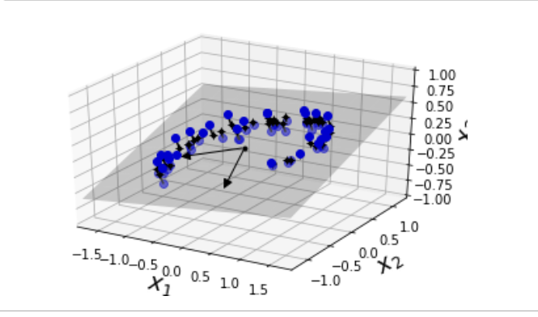
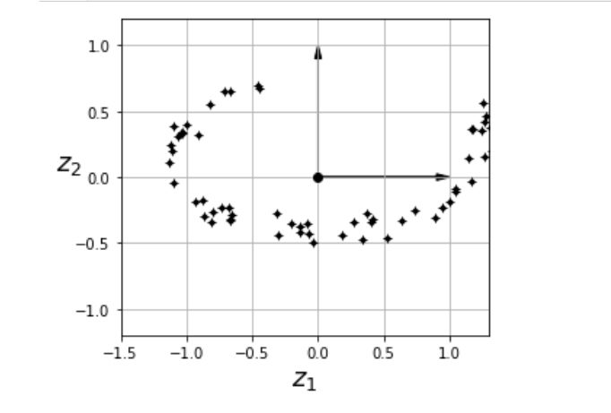

# Dimensionality reduction

Is a way to reduce the complexity if features, known as the curse of dimensionality.

Dimensionally is also very useful for data visualisation.
It helps us gain some important insights.
High dimesnional hypercubes are very sparse.

### Projection to remove dimensionality

In most real world problems the training instances are not spread uniformly accross all dimensions.

projection however doesn'twork when the model is omsthing like a swiss roll.

### manifold learning

A 2d manifold is a 2D shape that can be bent and twisted in ahigher dimensional space. A d dimensional manifold is a part in a higher-dimensional space. More generally a d dimensional manifold is a part of an n-dimensional space (d<n) that locally resembles a d hyperplane.

example of 3D dataset lying close to a 2D subspace:

Converting it into projection in 2D plane:

Many dimensionality reduction algorithms work by modelling the manifold on which training instances lie this is called manifold learning it relies on manifold assumption also called manifold hypothesis which holds modt real world high dimensionality datasets lie lose to a much lower dimensional manifold. 

in mnist the degree of freedom to create an digit image is very lower than degree of freedom to create any image of your choice. these contraints squeeze the datset into a lower dimensional manifold.

Manifold assumption is often accompanied by another implicit assumption. that the task at hand will be simpler if expressed in the lower dimensional space of the manifold.

However its not always true that dimensionality reduction will help in easy creation of decision boundary. Evenif it speeds up training time.

## PCA

Principle component analysis(PCA) identifies the hyperplane closes to the data, and then projjects data onto it.

### preserving the variance

before actual projection, we need to choose the right hyperplane. 
we choose the axis that preserves most amount of variance.Or the axis that minimises the mean squared distance between the original dataset and its projection onto that axis. This is the idea behind PCA.

### principal component

A unit vector that defines the ith axis is called ith principal component (PC). 

Finding the principle componenet is done through sinular value decompositions

Decomposing the training set matrix X into dot product of three matrices U . Sigma . V.T where V the contains the principle component we are looking for

The direction of PC is not stable it changes direction when we perturb the data and run PCA again.

PCA assumes that the datset is centered around the origin. Scikit-Learn's PCA classes take care of centring the data for yourself. HOwever if you implement PCA yourself don't forget to center the data first.

### projecting to d dimensions

Selecting the hyperplane ensures that the projection will preserve as much variation as possible. 

Projection simple means computing the dot product of the traiing set matrix X by the matrix Wd defined as the matrix containing the first d principal components.

