# Dimensionality reduction

Is a way to reduce the complexity if features, known as the curse of dimensionality.

Dimensionally is also very useful for data visualisation.
It helps us gain some important insights.
High dimesnional hypercubes are very sparse.

### Projection to remove dimensionality

In most real world problems the training instances are not spread uniformly accross all dimensions.

projection however doesn'twork when the model is omsthing like a swiss roll.

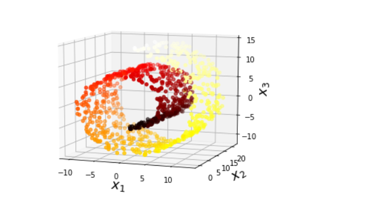

### manifold learning

A 2d manifold is a 2D shape that can be bent and twisted in ahigher dimensional space. A d dimensional manifold is a part in a higher-dimensional space. More generally a d dimensional manifold is a part of an n-dimensional space (d<n) that locally resembles a d hyperplane.

example of 3D dataset lying close to a 2D subspace:

Converting it into projection in 2D plane:

Many dimensionality reduction algorithms work by modelling the manifold on which training instances lie this is called manifold learning 

it relies on manifold assumption also called manifold hypothesis which holds modt real world high dimensionality datasets lie lose to a much lower dimensional manifold. 

in mnist the degree of freedom to create an digit image is very lower than degree of freedom to create any image of your choice. these contraints squeeze the datset into a lower dimensional manifold.

Manifold assumption is often accompanied by another implicit assumption. that the task at hand will be simpler if expressed in the lower dimensional space of the manifold.

However its not always true that dimensionality reduction will help in easy creation of decision boundary. Evenif it speeds up training time.

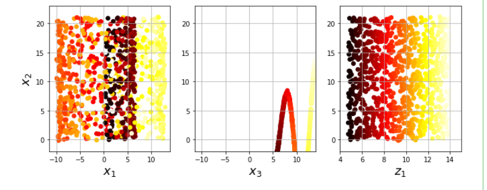

## PCA

Principle component analysis(PCA) identifies the hyperplane closes to the data, and then projjects data onto it.

On swiss roll of arbitary positive negative
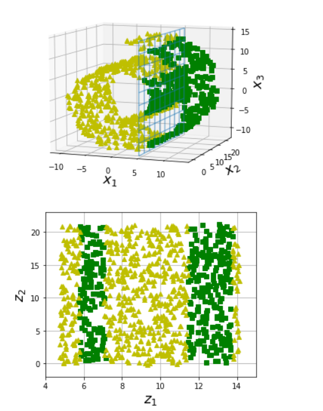

Changing postive negative and impact on swiss roll
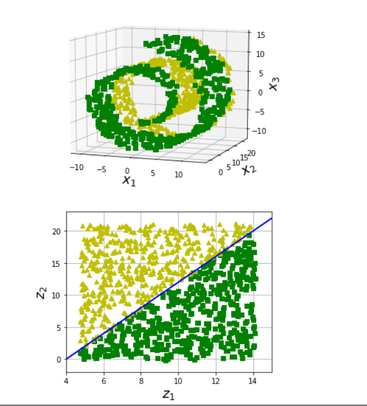

### preserving the variance

before actual projection, we need to choose the right hyperplane. 
we choose the axis that preserves most amount of variance.Or the axis that minimises the mean squared distance between the original dataset and its projection onto that axis. This is the idea behind PCA.

PCA variance plot
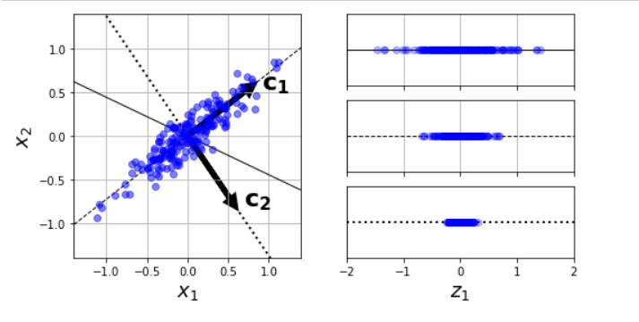

### principal component

A unit vector that defines the ith axis is called ith principal component (PC). 

Finding the principle componenet is done through singular value decompositions

Decomposing the training set matrix X into dot product of three matrices U . Sigma . V.T where V the contains the principle component we are looking for

The direction of PC is not stable it changes direction when we perturb the data and run PCA again. However the plane defined will be the same.

PCA assumes that the datset is centered around the origin. Scikit-Learn's PCA classes take care of centring the data for yourself. HOwever if you implement PCA yourself don't forget to center the data first.

### projecting to d dimensions

Selecting the hyperplane ensures that the projection will preserve as much variation as possible. 

Effect of parameters on variance:
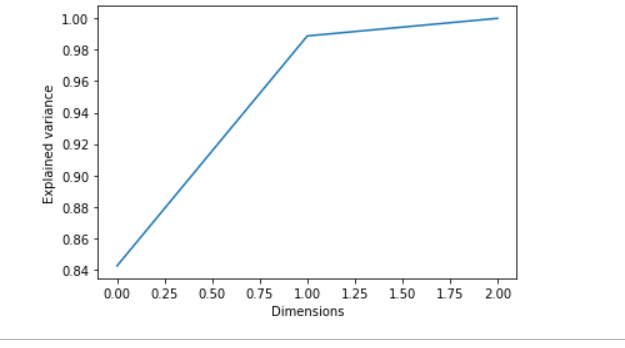

Projection simple means computing the dot product of the traiing set matrix X by the matrix Wd defined as the matrix containing the first d principal components.

### PCA for compression

When we apply PCa over mnist we find that each feature has just 150 features instead of 784, original features.

We can also decompress by applying inverse PCA projection transform. The original data is not given back compelety though. 5% is dropped. 

The mean square distance betweem the original data and the reconstructed data us called reconstruction error.

mnist compression:
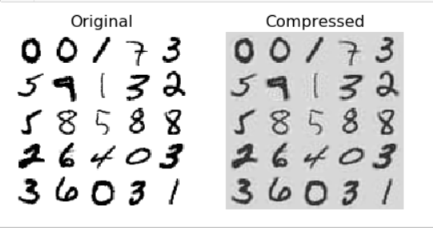

### Incremental PCA

One problem with normal PCA is that it requires the whole training set to fit in memory for SVD algorithm to run.

In incremental PCA you can split the training set into mini batches and feed the Inceremental PCA algorithm one mini batch at the time.

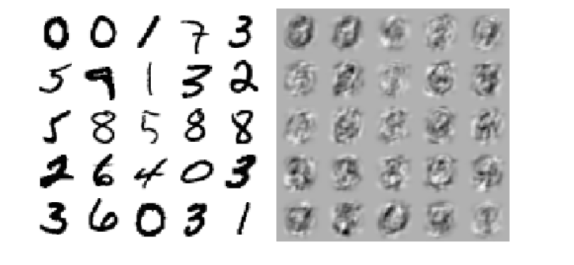

### randomised PCA

It stochastically builds an approximation on given number of features. It is quick.

PCA vs Randomised on number of samples
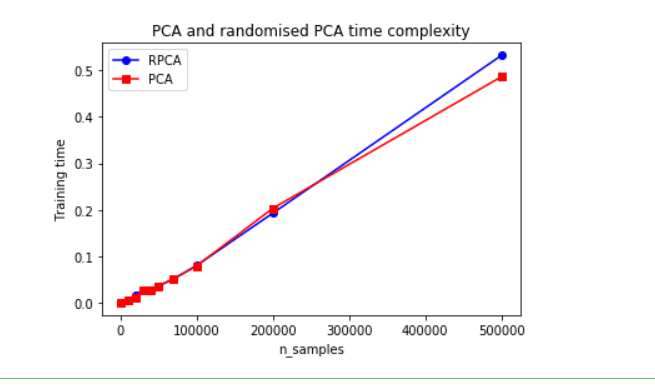

PCA vs Randomized on number of features
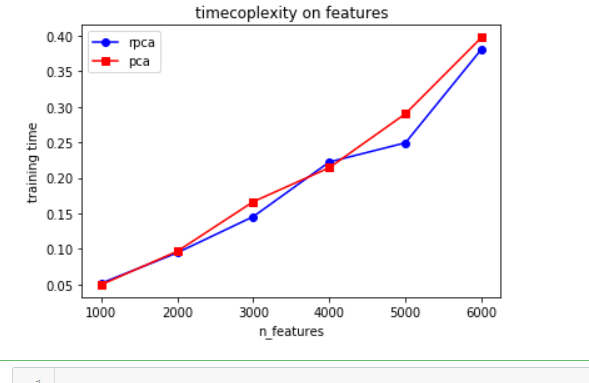

### Kernal PCA

Kernal trick is a mathematical technique that maps instances to a very high dimensional space called feature space. This enables us to do nolinear classification and regression. 

A linear decision boundary in high_dimesnional space  corresponds to complex nonlienar decision buondary in original space.

It turns out that same trick can be applied to PCA, makingit possible to perform complex non linear projections for dimensionality reduction. This is called Kernal PCA.

differnet kernal PCA transformation based on kernel:
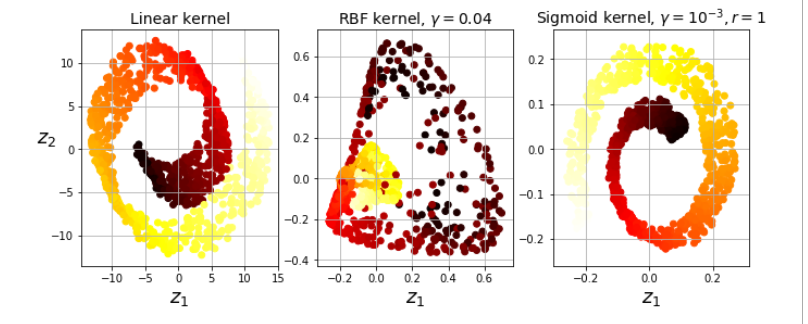

kPCA is good at preserving clusters of instances after projection. and even unrolls datasets.

### Local Linear Embedding

It is another very powerful nonlinear dimesnionality reduction technique. It is a manifold learning technique that does not rely on projection . 

LLE works by first measuring how each training instance linearly relates to its closest neighbhors and then looking for low - dimensional representation of the thre training set where these local relationships  are best preserved.

for each training instance x(i) the algorithm identifies its k closest neighbors (in the preceding code k=10) then tries to recontruct. x as a linear function of there neighbhors more specifically it finds weights w(i,j) such that the squared distance between x and sum(w(i,j)x(j)) is as small as possible. assuming w(i,j) =0 if x is not the k closest neigbhor of x(i)

THis first step is a contraint optimisation problem with weights W.the second constraint simply normalises the weights for each training instances x(i).

computational complexity:
for finding k nearest neighbors O(m log(m)nlog(k))
for optimising wieghts O(mnk^3)
for recontsruction of lowe dimesnional represenstation O(dm^2)

### MDS, Isomap and t-SNE

MDS :  multi dimensional Scaling - reduces dimensionality whilepreserving disatnace between instances.

Isomap : creates a graph by connecting each instances to its nearest neighbors then reduces dimensionality while trying to preserve geodesic distances between the instances, geodesic distance between two nodes is a graph is the number of nodes on the shortest path berween these nodes.

t-SNE : reduces dimensionality while tryinig to keep similar instances close and dissimilar instances apart used for visualisation

Linear Discriminant Analyssis :  Is actualy a classificiation algogrithm but during training it learns the most discriminative axes between the classes and these axes can then be used to define a hyperplane onto which to project the data. The benefit being that the projection will make the classes as fara apart as possible, so LDA is a good technique to reduce dimensionality before applying something like the svm classifier.

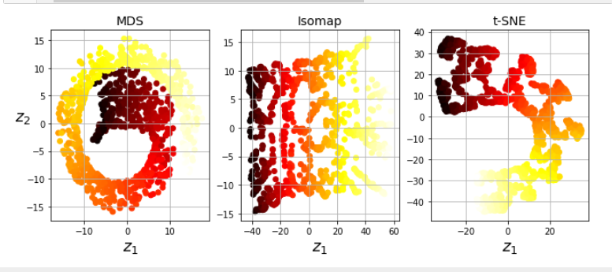

# Clustering and classification

On Iris dataset typical representation of cluster and classification
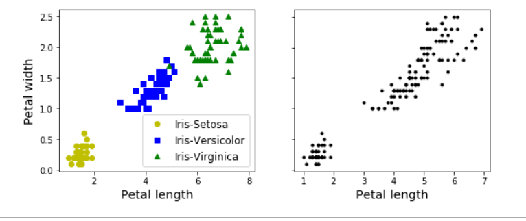

We can do cluster classfiication usign gaussian mixture
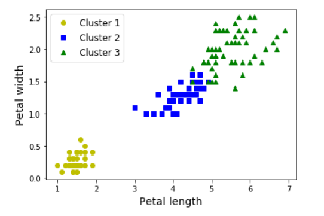

### K means
We can do clustering through K meansalgorithm

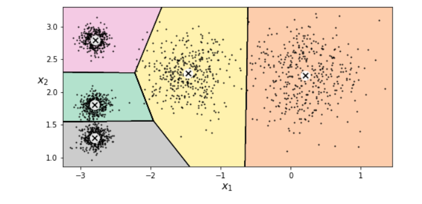

Hard clustering -  making predictions at an arbitary distance form centroid
soft clustering - using euclidean distance to make clusters

Algorithm:

first initialise k centroids randomly: k distinct instances are chosen randomly from dataset and the centroids are placed at their locations

Repeat until convergence
assign each instance to the closest centroid
update the centroids to be the mean of the instances that are assigned to them

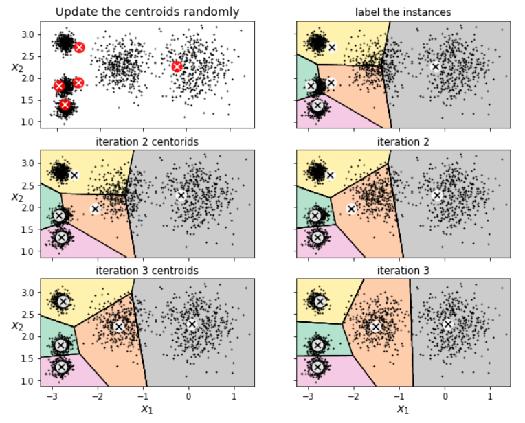

Kmeans is optimised version. Original K means can be obtained by set init="random", n_init=1 and algorithm="full"

K means variability
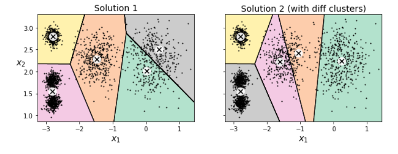

### K means ++

Instead of inititalising the centroids randomly we can inititlise using algorithm given by David Arthur and Sergei Vassilvitskii

Take one centroid c1
Take a new center c(i) choosing instance x(i) with probability D(x(i)^2/ sum(D(x(j)^2)
where D(x(i)) is the distance between instance x(i) and the closest centroid that was already chosen.

repeat till allcentroids are chosen
Rest is just reguar Kmeans. we just have to select k-means++ , whic is by default

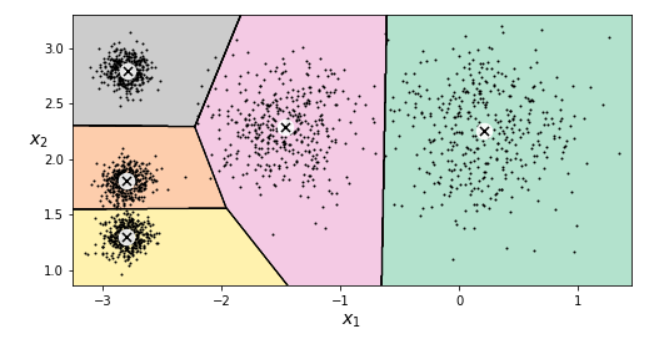

### K means minibatch

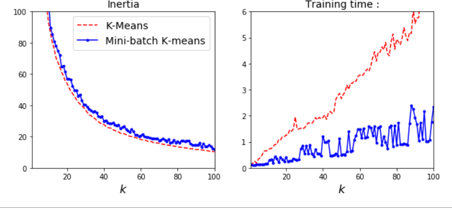

