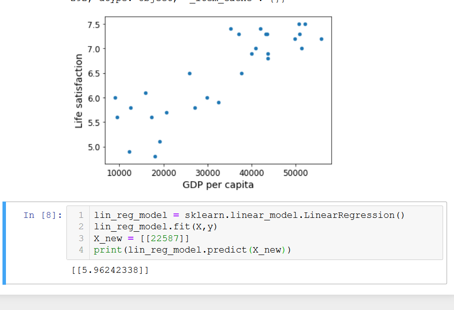

# First Chapter

## types of machine learning
Supervised  - labels
Unsupervised - no labels ex.clustering , visualisation and dimensionality reduction, association rule learning
Semisupervised - onelabel per image rest clustering like google photos
Reinforcement - policy based state choosing,alpha go

Batch learning - The system is incapable of learning incremently, all data must be supplied at once. Also called offline learning

Online Learning - The system learns incremently after feeding it data continuosly or in batches, new data on the fly. The learning rate becomes important in these systems. 

Instance based Learning - it learns examples by heart then using a similarity measure generlaiszes to new cases.
Model based Learning - Build a model and then make predictions

### code break
Intro to scikit learn:

## main challenges to ml

1. Insufficient quantity training data
2. Non representative training data
3. Poor quality data
4. irrelevant data
5. Overfitting the training - way out is hyperparameters tuning
6. Underfitting

## testing and validating

1. We can split our data into 2 sets: training and testing set, 80/20 split.
2. No free lunch - bestway to evaluate a model is to test it.
