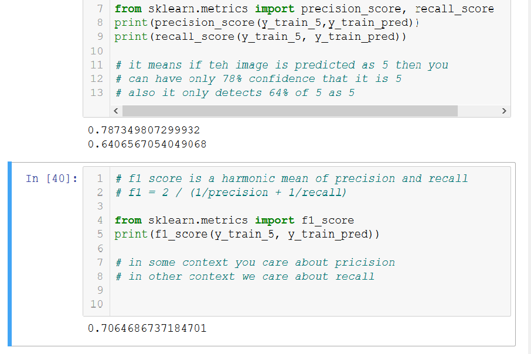

# MNIST CLASSIFICATION

## mnist data
Every scikit learn dataset has a
DESCR key
Data key and 
Target key

## Binary classification

Evaluating for five and not five

1.using Stochastic gradient descent
2. Performance measures - cross validation
    custom cross validation and cross_val_score()
    We dont take in accuracy as the valid measure of performance
    because in skewed databases accuracy can be misleadingas is how by 
    a trivial never 5 classifier
    

3. Confusion matrix
    We count the number of instances of classA wrongly classified as B
    To compute this we need to have a set of predictions, we dont use test set
    but use cross_val_predict()

4.F1 score care about the harmonic mean between precision and recall 
    if you want a child lock then you would want to have low recall
    if you want to use it for video classification then you want 99 recall
    
    There is a tradeoff between precision and recall. Which means what you want most confidence in predictions or predicting more values

5. ROC curve
Reciever operating characteristics , similar to precision and recall curve but instead it plots true positive rate (recall) with false positive rate 
    
    
    