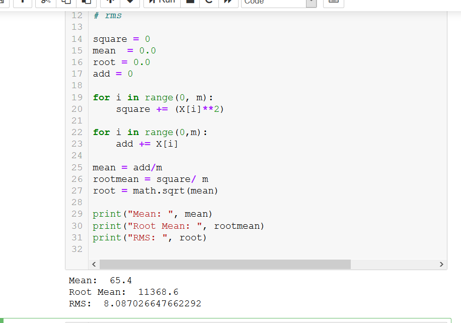
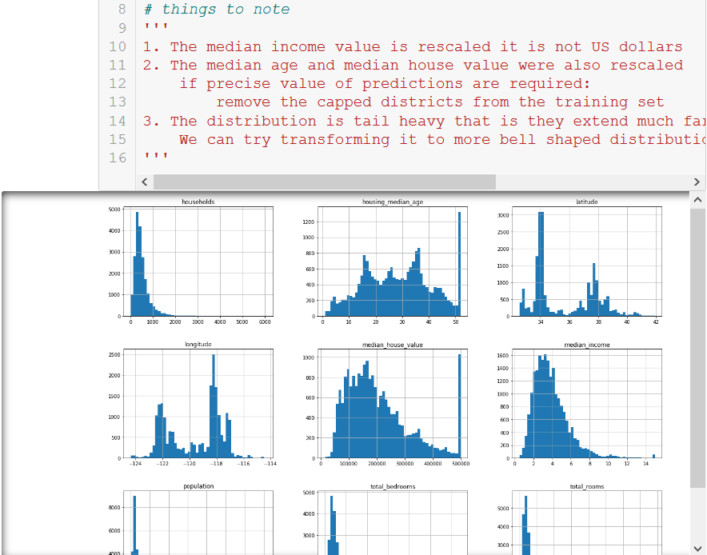
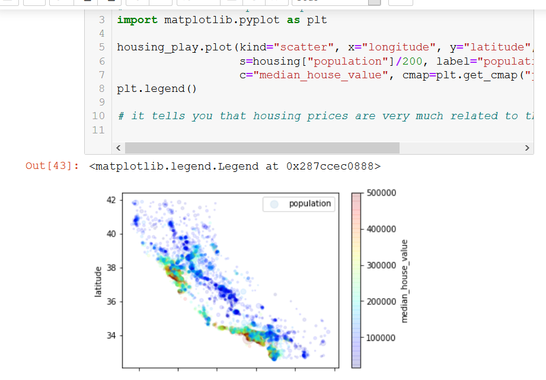
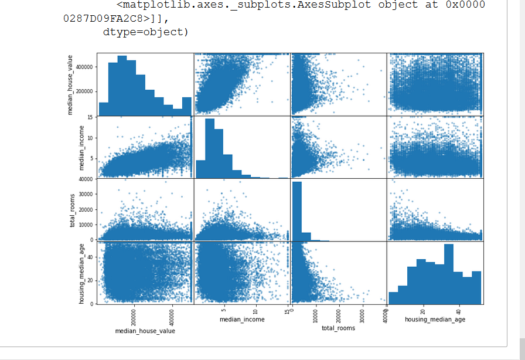
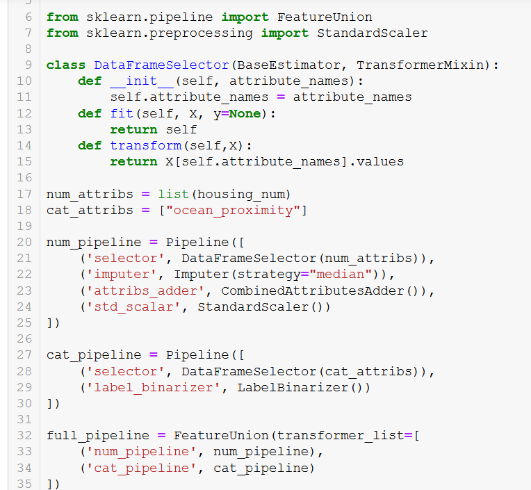

## Knowing the task to classify

multivariate regression - multiple features are taken into consideration
univariate regression - single feature is considered

If the data is huge then we can do online learning, maybe even implement mapreduce.

1. Know the task
2. Select a performance measure

    Ex - Root mean square error (RMSE)
    t measures the standard deviation of the errors the system makes in its   predictions

    rmse(X,h) = root of ((sum of h(x) - y/ mean) ^ 2)

    A small root mean square program in python :
    

3. Check the assumptions

The histogram after loading data

sidenote on stratified sampling:
    it means sampling with taking onto account the population bias
    if there are 51.3 male and 48.7 female
    then a stratified sample of 1000 will have 513 male and 487 female

5. visualising the data to gain insights

6. Look for correlations
    Corelation ranges from -1 to 1
    close to 0 means no effect
    when it is close to 1 it means positive corelation (directly proportional)
    when it goes to -1 negative corelation (inversly proportional)

7. Create attribute combinations

8. Prepare data for machine learning algorithms

Create functions so that you can apply it in future algorithms

9. Data cleaning
    Remove attributes
    getting rid of rows
    replace missing with median

    Scikit learn designs principles:
        1. consistency:
            estimators : Any object that can estimate based on a dataset( like imputer)
            uses fit method
            transformers : when some estimators can transform the dataset
            predictors: has a predictor function and score() method to evaluate the prediction
        2. Inspection : all hyperparameters are globally accessible
        3. Nonproliferation of classes : allare numpyor scipy arrays
        4. Composition: existing building blocks are reused as much as possible
        5. sensible defaults : for creating baeseline models quickly

    a. Converting text and categorical attributes

    b. Writing custom transformers for cleanup
    
10. Feature scaling
    All features must have the same range otherwise modelsdon't work properly

two ways for scaling -

 1.min max scaling (normalisation) -  values are scaled and shifted so that they range from 0 to 1, done by MinMaxScaler in scikit

 2. standardisation - first it substracts mean value and devides by variance so that data has unit variance, Very less affected by outliers but range is not 0,1. Done by StandardScalar in scikit
 
 
11. Transformation pipelines

        
        

        
