# Study of Maths 

## Vectors in 3d space
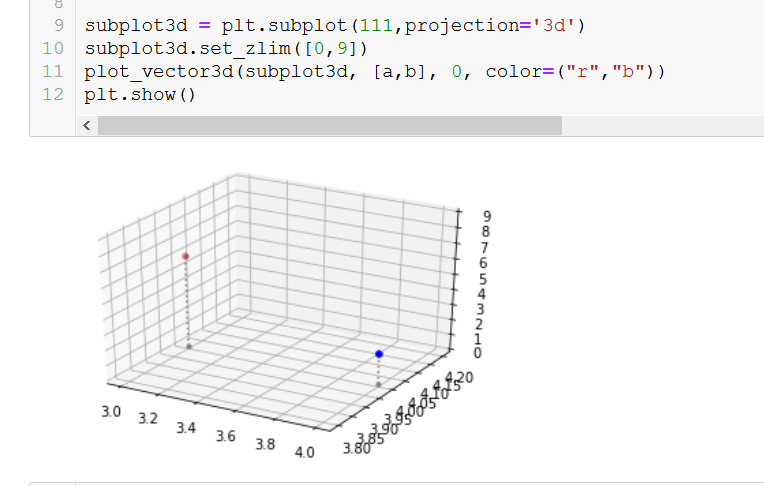

## Norm
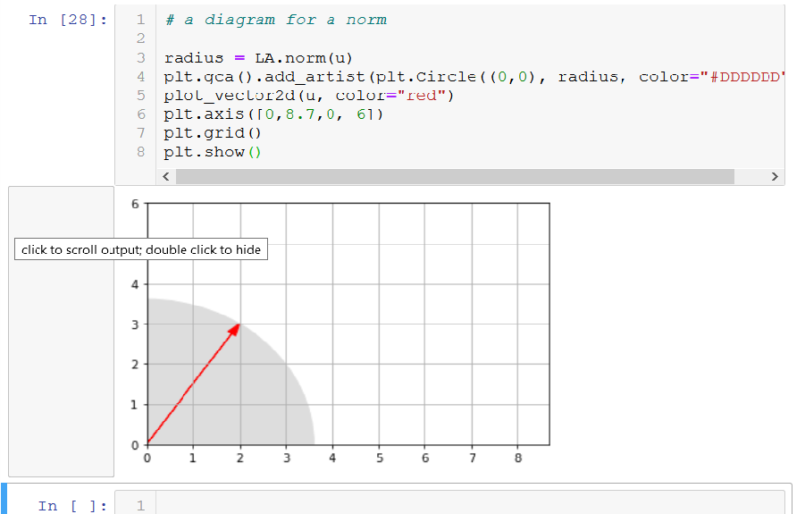

## Addition
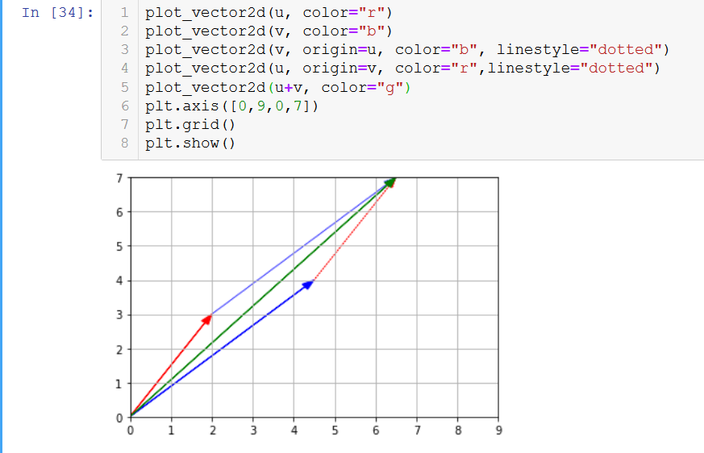

## Geometric translation
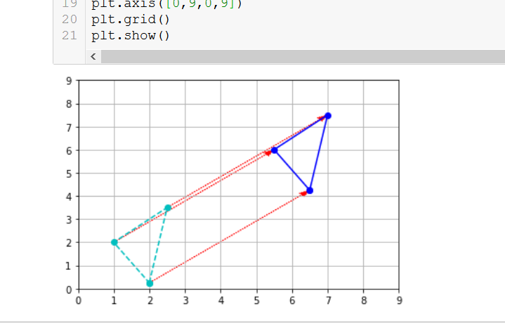

## Scalar multiplication
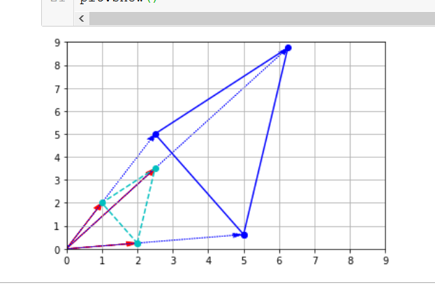

## Normalisation
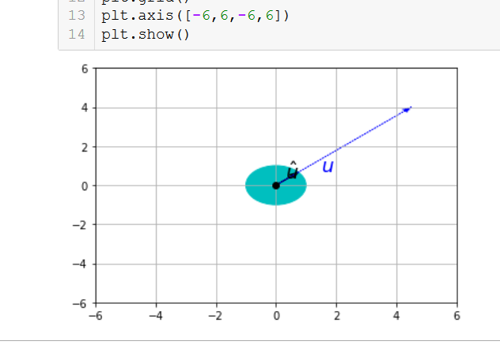

## Vector projection
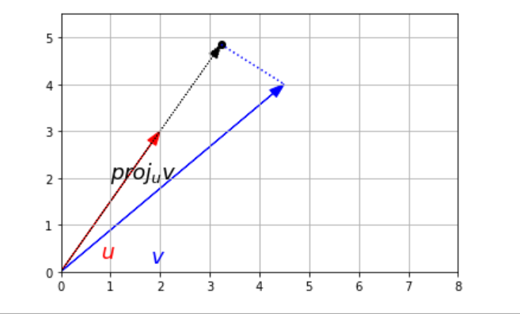

## Matrix addition
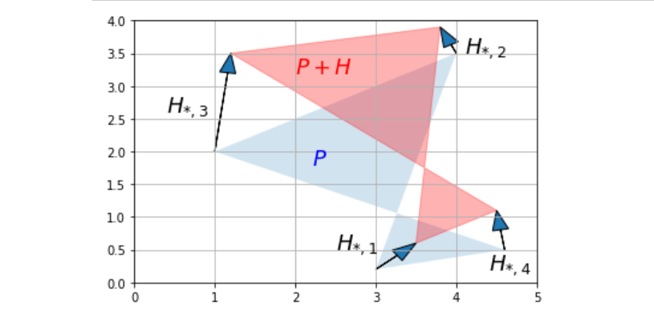

## Direct translation
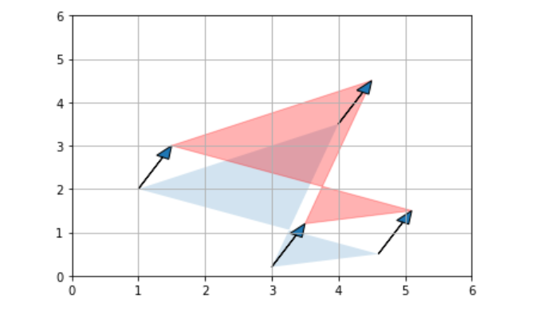

## Scalar multiplication
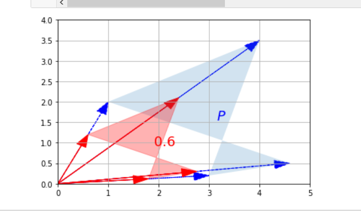

## Matrix projection
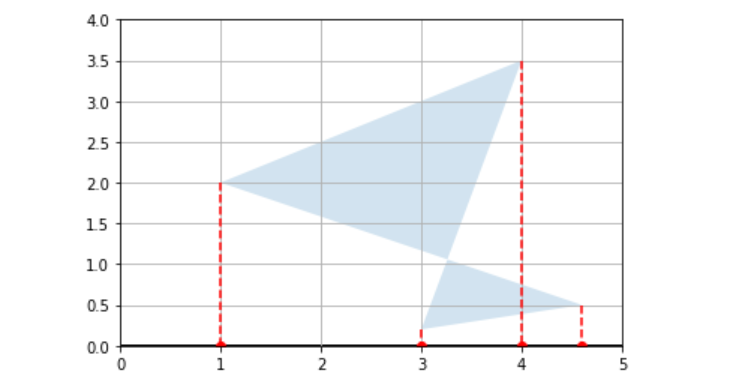

## Matrix projection on random axis
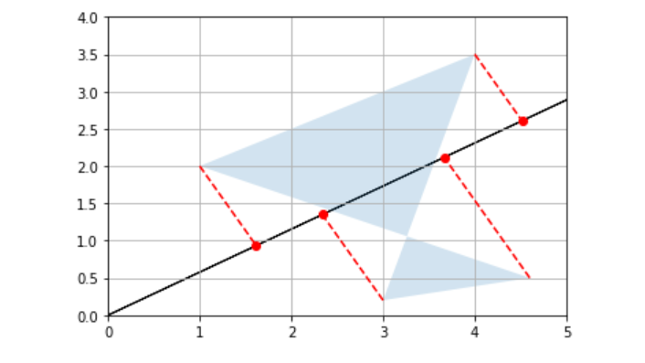

## Matrix rotation
Nothing but projecting on an unit vector at an angle
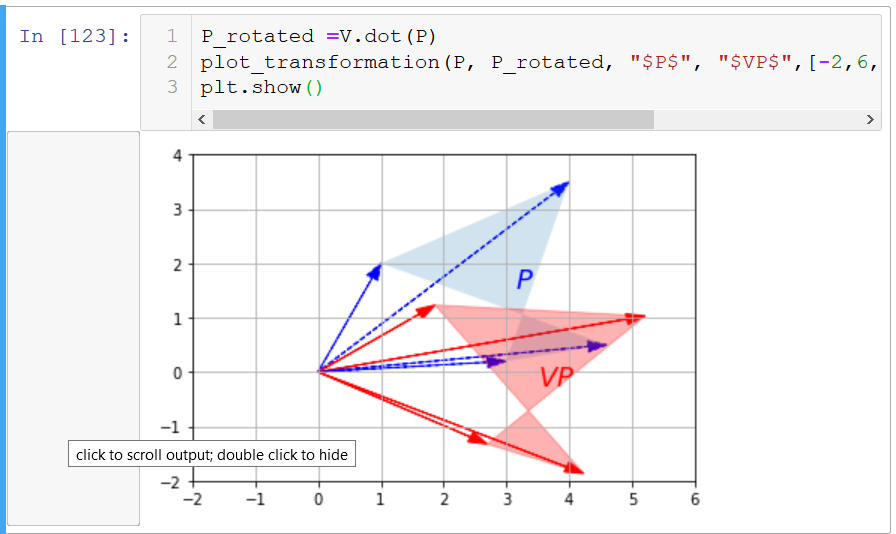

## Matrix shear
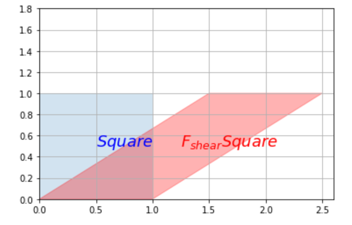

## Matrix squeeze
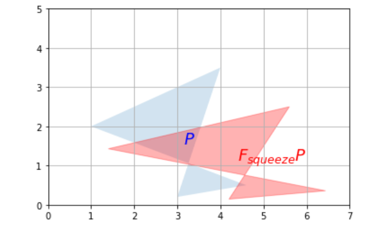

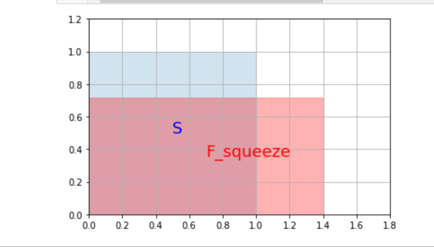

## Matrix reflect
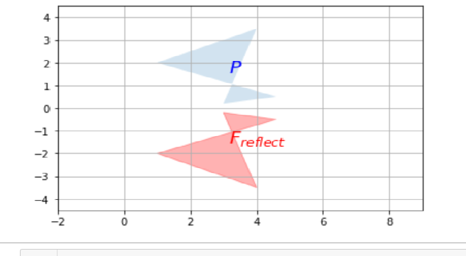

## Matrix involution
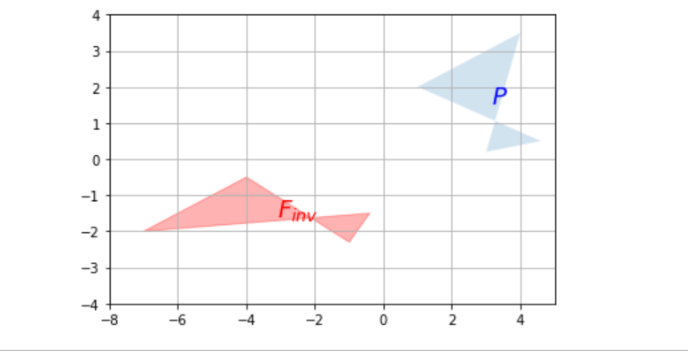

## Matrix inverse of shear
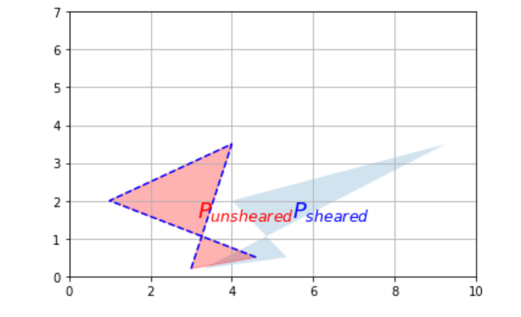

## Matrix projection onto horizontal cannot be inverse
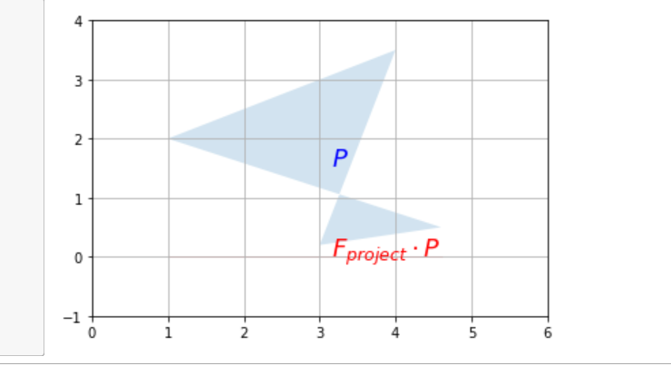

## Matrix projection onto a horizontal at an angle
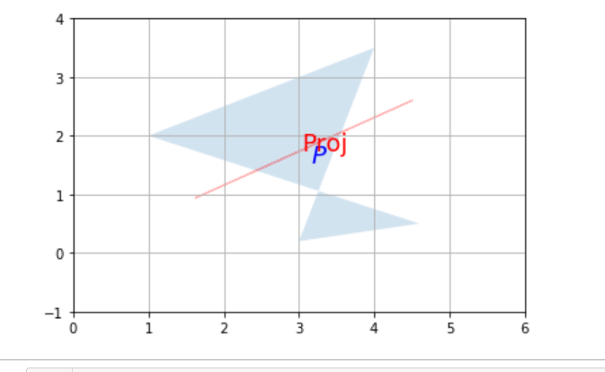

## Singular decomposition
### After applying v.t dot on square
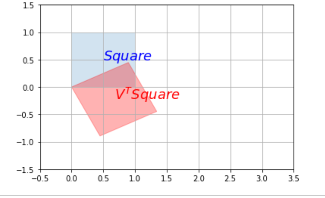

### After applying sigma dot on previous
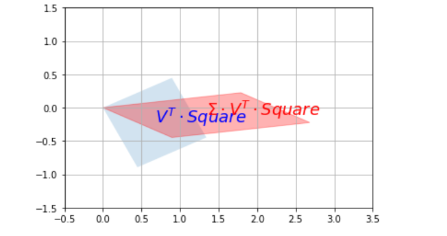

### After applying rotation U dot equal to shear operation
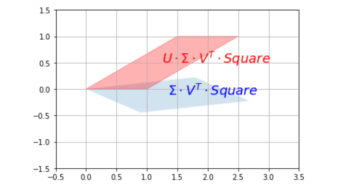